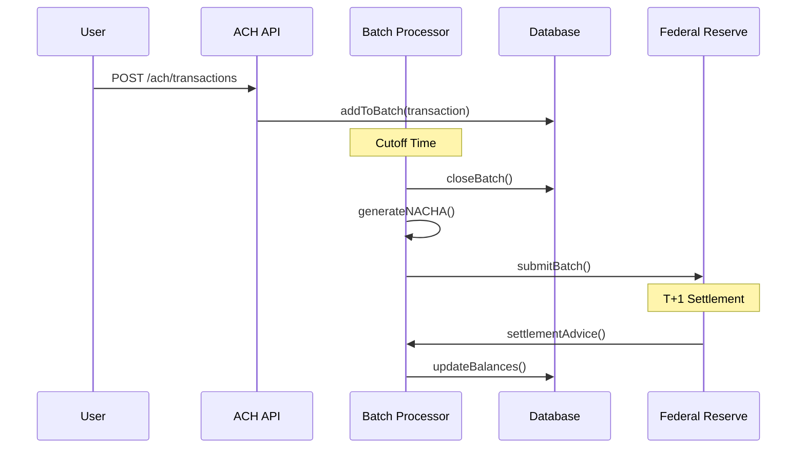

# ARQUITETURA ACH/CLEARING - VISANETPAY
## Data: 21/08/2024 - Arquiteto: Bob

---

## 🎯 VISÃO GERAL
Sistema ACH (Automated Clearing House) completo com processamento em lotes, clearing automático e compliance ISO 20022 para transferências internacionais.

---

## 📊 ESTRUTURA DE DADOS

### **Tabela: ach_batches**
```sql
CREATE TABLE ach_batches (
  id UUID PRIMARY KEY DEFAULT gen_random_uuid(),
  batch_number VARCHAR(10) UNIQUE NOT NULL,
  batch_date DATE NOT NULL,
  cutoff_time TIME NOT NULL,
  status VARCHAR(20) DEFAULT 'pending' CHECK (status IN ('pending', 'processing', 'completed', 'failed')),
  total_credit_amount DECIMAL(15,2) DEFAULT 0,
  total_debit_amount DECIMAL(15,2) DEFAULT 0,
  transaction_count INTEGER DEFAULT 0,
  created_at TIMESTAMP DEFAULT NOW(),
  processed_at TIMESTAMP,
  settlement_date DATE
);

CREATE INDEX idx_ach_batches_date ON ach_batches(batch_date);
CREATE INDEX idx_ach_batches_status ON ach_batches(status);
```

### **Tabela: ach_transactions**
```sql
CREATE TABLE ach_transactions (
  id UUID PRIMARY KEY DEFAULT gen_random_uuid(),
  batch_id UUID REFERENCES ach_batches(id),
  sender_id UUID REFERENCES auth.users(id),
  receiver_routing_number VARCHAR(9) NOT NULL,
  receiver_account_number VARCHAR(17) NOT NULL,
  receiver_name VARCHAR(100) NOT NULL,
  amount DECIMAL(15,2) NOT NULL,
  transaction_type VARCHAR(3) CHECK (transaction_type IN ('PPD', 'CCD', 'CTX', 'WEB')),
  company_entry_description VARCHAR(10),
  individual_id_number VARCHAR(15),
  addenda_record TEXT,
  trace_number VARCHAR(15) UNIQUE,
  status VARCHAR(20) DEFAULT 'pending' CHECK (status IN ('pending', 'processing', 'completed', 'returned', 'failed')),
  return_code VARCHAR(3),
  effective_date DATE,
  created_at TIMESTAMP DEFAULT NOW(),
  processed_at TIMESTAMP
);

CREATE INDEX idx_ach_transactions_batch ON ach_transactions(batch_id);
CREATE INDEX idx_ach_transactions_sender ON ach_transactions(sender_id);
CREATE INDEX idx_ach_transactions_trace ON ach_transactions(trace_number);
```

### **Tabela: iso20022_messages**
```sql
CREATE TABLE iso20022_messages (
  id UUID PRIMARY KEY DEFAULT gen_random_uuid(),
  message_type VARCHAR(20) NOT NULL, -- pain.001, pacs.008, etc
  message_id VARCHAR(35) UNIQUE NOT NULL,
  creation_datetime TIMESTAMP NOT NULL,
  number_of_transactions INTEGER NOT NULL,
  control_sum DECIMAL(18,2) NOT NULL,
  initiating_party VARCHAR(100),
  message_content JSONB NOT NULL,
  validation_status VARCHAR(20) DEFAULT 'pending' CHECK (validation_status IN ('pending', 'valid', 'invalid')),
  processing_status VARCHAR(20) DEFAULT 'pending' CHECK (processing_status IN ('pending', 'processing', 'completed', 'failed')),
  created_at TIMESTAMP DEFAULT NOW(),
  processed_at TIMESTAMP
);

CREATE INDEX idx_iso20022_type ON iso20022_messages(message_type);
CREATE INDEX idx_iso20022_status ON iso20022_messages(processing_status);
```

---

## 🔌 API ENDPOINTS

### **ACH Processing**
```typescript
// Criar transação ACH
POST /api/ach/transactions
{
  receiverRoutingNumber: string,
  receiverAccountNumber: string,
  receiverName: string,
  amount: number,
  transactionType: 'PPD' | 'CCD' | 'CTX' | 'WEB',
  effectiveDate: string,
  description?: string
}

// Processar lote
POST /api/ach/batches/:batchId/process

// Consultar settlement
GET /api/ach/settlement/report?date=2024-08-21
```

---

## 🏗️ SISTEMA DE CLEARING/SETTLEMENT

### **Processamento em Lotes**
```typescript
class ACHBatchProcessor {
  private readonly CUTOFF_TIMES = {
    SAME_DAY: ['10:30', '13:00', '16:00'],
    NEXT_DAY: '18:00'
  };

  async processCutoff(cutoffTime: string) {
    const currentBatch = await this.getCurrentBatch();
    
    if (currentBatch.transaction_count > 0) {
      await this.closeBatch(currentBatch.id);
      await this.generateNACHAFile(currentBatch.id);
      await this.submitToFederal(currentBatch.id);
    }
    
    await this.createNewBatch();
  }

  async generateNACHAFile(batchId: string): Promise<string> {
    const batch = await this.getBatchWithTransactions(batchId);
    
    return new NACHAFileBuilder()
      .addFileHeader({
        immediateDestination: '091000019',
        immediateOrigin: '123456789',
        fileCreationDate: new Date().toISOString().slice(0, 10).replace(/-/g, ''),
        fileCreationTime: new Date().toTimeString().slice(0, 8).replace(/:/g, '')
      })
      .addBatchHeader({
        serviceClassCode: '200',
        companyName: 'VISANETPAY',
        companyIdentification: '123456789',
        standardEntryClassCode: 'PPD',
        effectiveEntryDate: batch.settlement_date
      })
      .addTransactions(batch.transactions)
      .build();
  }
}
```

---

## 📋 ISO 20022 COMPLIANCE

### **Message Types**
```typescript
const ISO20022_SCHEMAS = {
  'pain.001.001.03': 'Customer Credit Transfer Initiation',
  'pain.008.001.02': 'Customer Direct Debit Initiation',
  'pacs.008.001.02': 'FI To FI Customer Credit Transfer',
  'camt.053.001.02': 'Bank to Customer Statement'
};

class ISO20022MessageBuilder {
  createCreditTransfer(transactions: Transaction[]): ISO20022Message {
    return {
      Document: {
        CstmrCdtTrfInitn: {
          GrpHdr: {
            MsgId: generateMessageId(),
            CreDtTm: new Date().toISOString(),
            NbOfTxs: transactions.length.toString(),
            CtrlSum: transactions.reduce((sum, tx) => sum + tx.amount, 0),
            InitgPty: { Nm: 'VisaNetPay' }
          },
          PmtInf: transactions.map(tx => ({
            PmtInfId: tx.id,
            PmtMtd: 'TRF',
            ReqdExctnDt: tx.effectiveDate,
            Dbtr: { Nm: tx.senderName },
            DbtrAcct: { Id: { IBAN: tx.senderAccount } },
            CdtTrfTxInf: [{
              PmtId: { InstrId: tx.id },
              Amt: { InstdAmt: { _: tx.amount, Ccy: 'USD' } },
              Cdtr: { Nm: tx.receiverName },
              CdtrAcct: { Id: { IBAN: tx.receiverAccount } }
            }]
          }))
        }
      }
    };
  }
}
```

---

## 🔄 FLUXOS DE PROCESSO

### **Fluxo ACH Completo**


---

## ⚡ EDGE FUNCTIONS

### **ach-processor.ts**
```typescript
import { serve } from "https://deno.land/std@0.168.0/http/server.ts";

serve(async (req) => {
  const { transactions, batchId } = await req.json();
  
  try {
    // Validate transactions
    for (const tx of transactions) {
      if (!validateRoutingNumber(tx.routingNumber)) {
        throw new Error(`Invalid routing number: ${tx.routingNumber}`);
      }
    }
    
    // Process batch
    const nachaFile = generateNACHAFile(transactions);
    const result = await submitToACH(nachaFile);
    
    return new Response(JSON.stringify({
      success: true,
      batchId: result.batchId,
      settlementDate: result.settlementDate
    }));
    
  } catch (error) {
    return new Response(JSON.stringify({ error: error.message }), {
      status: 500
    });
  }
});

function validateRoutingNumber(routing: string): boolean {
  if (routing.length !== 9) return false;
  
  const checksum = [3, 7, 1, 3, 7, 1, 3, 7, 1];
  const sum = routing.split('').reduce((acc, digit, index) => {
    return acc + parseInt(digit) * checksum[index];
  }, 0);
  
  return sum % 10 === 0;
}
```

---

**STATUS: Arquitetura ACH/Clearing completa**