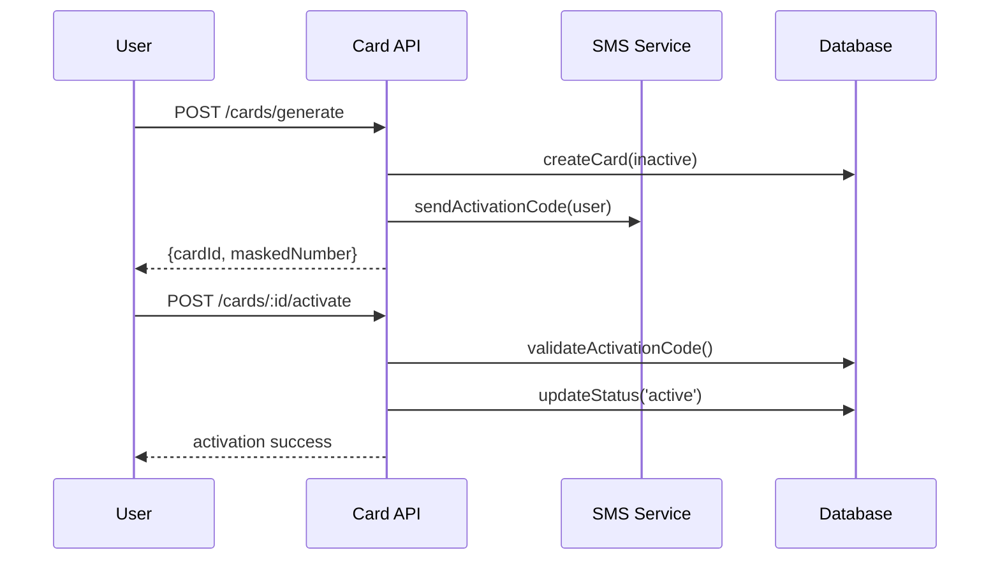

# ARQUITETURA CARTÕES BANCÁRIOS - VISANETPAY
## Data: 21/08/2024 - Arquiteto: Bob

---

## 🎯 VISÃO GERAL
Sistema completo de cartões bancários com geração segura, validação Luhn, BIN ranges, PCI DSS compliance e lifecycle management.

---

## 📊 ESTRUTURA DE DADOS

### **Tabela: card_bins**
```sql
CREATE TABLE card_bins (
  id UUID PRIMARY KEY DEFAULT gen_random_uuid(),
  bin_range_start VARCHAR(6) NOT NULL,
  bin_range_end VARCHAR(6) NOT NULL,
  card_brand VARCHAR(20) NOT NULL CHECK (card_brand IN ('VISA', 'MASTERCARD', 'AMEX', 'DISCOVER')),
  card_type VARCHAR(20) NOT NULL CHECK (card_type IN ('DEBIT', 'CREDIT', 'PREPAID')),
  country_code VARCHAR(3) DEFAULT 'USA',
  issuer_name VARCHAR(100) DEFAULT 'VisaNetPay',
  is_active BOOLEAN DEFAULT true,
  created_at TIMESTAMP DEFAULT NOW()
);

INSERT INTO card_bins (bin_range_start, bin_range_end, card_brand, card_type) VALUES
('400000', '499999', 'VISA', 'DEBIT'),
('510000', '559999', 'MASTERCARD', 'DEBIT'),
('340000', '349999', 'AMEX', 'CREDIT'),
('370000', 'AMEX', 'CREDIT');
```

### **Tabela: cards**
```sql
CREATE TABLE cards (
  id UUID PRIMARY KEY DEFAULT gen_random_uuid(),
  user_id UUID REFERENCES auth.users(id),
  card_number_encrypted TEXT NOT NULL,
  card_number_hash VARCHAR(64) NOT NULL UNIQUE,
  cvv_encrypted TEXT NOT NULL,
  expiry_month INTEGER NOT NULL CHECK (expiry_month BETWEEN 1 AND 12),
  expiry_year INTEGER NOT NULL,
  cardholder_name VARCHAR(100) NOT NULL,
  card_type VARCHAR(20) NOT NULL CHECK (card_type IN ('VIRTUAL', 'PHYSICAL')),
  card_brand VARCHAR(20) NOT NULL,
  status VARCHAR(20) DEFAULT 'inactive' CHECK (status IN ('inactive', 'active', 'blocked', 'expired', 'cancelled')),
  daily_limit DECIMAL(10,2) DEFAULT 1000.00,
  monthly_limit DECIMAL(10,2) DEFAULT 10000.00,
  balance DECIMAL(15,2) DEFAULT 0.00,
  pin_hash VARCHAR(64),
  activation_code VARCHAR(6),
  activation_expires_at TIMESTAMP,
  last_used_at TIMESTAMP,
  created_at TIMESTAMP DEFAULT NOW(),
  updated_at TIMESTAMP DEFAULT NOW()
);

CREATE INDEX idx_cards_user_id ON cards(user_id);
CREATE INDEX idx_cards_hash ON cards(card_number_hash);
CREATE INDEX idx_cards_status ON cards(status);
```

### **Tabela: card_transactions**
```sql
CREATE TABLE card_transactions (
  id UUID PRIMARY KEY DEFAULT gen_random_uuid(),
  card_id UUID REFERENCES cards(id),
  transaction_type VARCHAR(20) NOT NULL CHECK (transaction_type IN ('PURCHASE', 'WITHDRAWAL', 'REFUND', 'RELOAD')),
  amount DECIMAL(15,2) NOT NULL,
  merchant_name VARCHAR(100),
  merchant_category VARCHAR(4),
  authorization_code VARCHAR(10),
  status VARCHAR(20) DEFAULT 'pending' CHECK (status IN ('pending', 'approved', 'declined', 'cancelled')),
  decline_reason VARCHAR(50),
  created_at TIMESTAMP DEFAULT NOW(),
  processed_at TIMESTAMP
);

CREATE INDEX idx_card_transactions_card_id ON card_transactions(card_id);
CREATE INDEX idx_card_transactions_date ON card_transactions(created_at);
```

---

## 🔌 API ENDPOINTS

### **Card Management**
```typescript
// Gerar novo cartão
POST /api/cards/generate
{
  cardType: 'VIRTUAL' | 'PHYSICAL',
  cardBrand: 'VISA' | 'MASTERCARD' | 'AMEX',
  cardholderName: string,
  dailyLimit?: number,
  monthlyLimit?: number
}

// Ativar cartão
POST /api/cards/:cardId/activate
{
  activationCode: string,
  pin: string
}

// Recarregar cartão
POST /api/cards/:cardId/reload
{
  amount: number,
  source: 'PIX' | 'TRANSFER' | 'CASH'
}

// Bloquear/Desbloquear
POST /api/cards/:cardId/block
POST /api/cards/:cardId/unblock
```

---

## 🔐 GERAÇÃO E VALIDAÇÃO SEGURA

### **Algoritmo de Luhn**
```typescript
class CardValidator {
  static validateLuhn(cardNumber: string): boolean {
    const digits = cardNumber.replace(/\D/g, '').split('').map(Number);
    let sum = 0;
    let isEven = false;

    for (let i = digits.length - 1; i >= 0; i--) {
      let digit = digits[i];
      
      if (isEven) {
        digit *= 2;
        if (digit > 9) {
          digit -= 9;
        }
      }
      
      sum += digit;
      isEven = !isEven;
    }
    
    return sum % 10 === 0;
  }

  static generateLuhnDigit(partialNumber: string): string {
    const digits = partialNumber.split('').map(Number);
    let sum = 0;
    let isEven = true; // Next position will be even from right

    for (let i = digits.length - 1; i >= 0; i--) {
      let digit = digits[i];
      
      if (isEven) {
        digit *= 2;
        if (digit > 9) {
          digit -= 9;
        }
      }
      
      sum += digit;
      isEven = !isEven;
    }
    
    const checkDigit = (10 - (sum % 10)) % 10;
    return checkDigit.toString();
  }

  static getBrandFromBIN(bin: string): string {
    const binNum = parseInt(bin);
    
    if (binNum >= 400000 && binNum <= 499999) return 'VISA';
    if (binNum >= 510000 && binNum <= 559999) return 'MASTERCARD';
    if (binNum >= 340000 && binNum <= 349999) return 'AMEX';
    if (binNum >= 370000 && binNum <= 379999) return 'AMEX';
    if (binNum >= 601100 && binNum <= 601199) return 'DISCOVER';
    
    return 'UNKNOWN';
  }
}
```

### **Gerador de Cartões Seguro**
```typescript
class SecureCardGenerator {
  async generateCard(userId: string, cardType: string, brand: string): Promise<Card> {
    // 1. Selecionar BIN apropriado
    const bin = await this.selectBIN(brand, cardType);
    
    // 2. Gerar número do cartão
    const cardNumber = this.generateCardNumber(bin);
    
    // 3. Gerar CVV
    const cvv = this.generateCVV(cardNumber);
    
    // 4. Gerar data de expiração
    const expiry = this.generateExpiry();
    
    // 5. Criptografar dados sensíveis
    const encryptedCard = await this.encryptSensitiveData(cardNumber);
    const encryptedCVV = await this.encryptSensitiveData(cvv);
    
    // 6. Criar hash para busca
    const cardHash = await this.createHash(cardNumber);
    
    return {
      id: generateUUID(),
      user_id: userId,
      card_number_encrypted: encryptedCard,
      card_number_hash: cardHash,
      cvv_encrypted: encryptedCVV,
      expiry_month: expiry.month,
      expiry_year: expiry.year,
      card_type: cardType,
      card_brand: brand,
      status: 'inactive',
      activation_code: this.generateActivationCode()
    };
  }

  private generateCardNumber(bin: string): string {
    // Gerar 9 dígitos aleatórios (15 total - 6 BIN)
    const randomDigits = Array.from({ length: 9 }, () => 
      Math.floor(Math.random() * 10)
    ).join('');
    
    const partialNumber = bin + randomDigits;
    const checkDigit = CardValidator.generateLuhnDigit(partialNumber);
    
    return partialNumber + checkDigit;
  }

  private generateCVV(cardNumber: string): string {
    // Algoritmo simplificado CVV (produção usaria HSM)
    const seed = cardNumber.slice(-4);
    const cvv = (parseInt(seed) * 7 + 123) % 1000;
    return cvv.toString().padStart(3, '0');
  }

  private generateActivationCode(): string {
    return Math.floor(100000 + Math.random() * 900000).toString();
  }
}
```

---

## 🔒 PCI DSS COMPLIANCE

### **Criptografia de Dados**
```typescript
class PCICompliantEncryption {
  private readonly AES_KEY = Deno.env.get('CARD_ENCRYPTION_KEY');
  
  async encryptCardData(plaintext: string): Promise<string> {
    const key = await crypto.subtle.importKey(
      'raw',
      new TextEncoder().encode(this.AES_KEY),
      { name: 'AES-GCM' },
      false,
      ['encrypt']
    );

    const iv = crypto.getRandomValues(new Uint8Array(12));
    const data = new TextEncoder().encode(plaintext);

    const encrypted = await crypto.subtle.encrypt(
      { name: 'AES-GCM', iv },
      key,
      data
    );

    const result = new Uint8Array(iv.length + encrypted.byteLength);
    result.set(iv);
    result.set(new Uint8Array(encrypted), iv.length);

    return btoa(String.fromCharCode(...result));
  }

  async decryptCardData(ciphertext: string): Promise<string> {
    const data = Uint8Array.from(atob(ciphertext), c => c.charCodeAt(0));
    const iv = data.slice(0, 12);
    const encrypted = data.slice(12);

    const key = await crypto.subtle.importKey(
      'raw',
      new TextEncoder().encode(this.AES_KEY),
      { name: 'AES-GCM' },
      false,
      ['decrypt']
    );

    const decrypted = await crypto.subtle.decrypt(
      { name: 'AES-GCM', iv },
      key,
      encrypted
    );

    return new TextDecoder().decode(decrypted);
  }

  createCardHash(cardNumber: string): Promise<string> {
    return crypto.subtle.digest(
      'SHA-256',
      new TextEncoder().encode(cardNumber + 'VISANETPAY_SALT')
    ).then(hash => {
      return Array.from(new Uint8Array(hash))
        .map(b => b.toString(16).padStart(2, '0'))
        .join('');
    });
  }
}
```

### **Controles de Segurança**
```typescript
class CardSecurityControls {
  async validateTransaction(cardId: string, amount: number, merchantCategory: string): Promise<boolean> {
    const card = await this.getCard(cardId);
    
    // 1. Verificar status do cartão
    if (card.status !== 'active') {
      throw new Error('Card not active');
    }
    
    // 2. Verificar limites
    const dailySpent = await this.getDailySpending(cardId);
    if (dailySpent + amount > card.daily_limit) {
      throw new Error('Daily limit exceeded');
    }
    
    // 3. Verificar saldo
    if (amount > card.balance) {
      throw new Error('Insufficient balance');
    }
    
    // 4. Análise de fraude
    const fraudScore = await this.calculateFraudScore(cardId, amount, merchantCategory);
    if (fraudScore > 0.8) {
      throw new Error('Transaction blocked - fraud risk');
    }
    
    return true;
  }

  private async calculateFraudScore(cardId: string, amount: number, merchantCategory: string): Promise<number> {
    let score = 0;
    
    // Verificar padrões incomuns
    const recentTransactions = await this.getRecentTransactions(cardId, 24); // 24 horas
    
    // Transação muito alta comparada ao histórico
    const avgAmount = recentTransactions.reduce((sum, tx) => sum + tx.amount, 0) / recentTransactions.length;
    if (amount > avgAmount * 5) score += 0.3;
    
    // Muitas transações em pouco tempo
    if (recentTransactions.length > 10) score += 0.2;
    
    // Categoria de risco
    const riskCategories = ['5993', '7995', '6051']; // Gambling, betting, etc
    if (riskCategories.includes(merchantCategory)) score += 0.4;
    
    return Math.min(score, 1.0);
  }
}
```

---

## 🔄 LIFECYCLE MANAGEMENT

### **Fluxo de Ativação**


### **Sistema de Recarga**
```typescript
class CardReloadService {
  async reloadCard(cardId: string, amount: number, source: string): Promise<Transaction> {
    const card = await this.getCard(cardId);
    
    // Validar limites de recarga
    const monthlyReloads = await this.getMonthlyReloads(cardId);
    if (monthlyReloads + amount > 50000) { // R$ 50k/mês
      throw new Error('Monthly reload limit exceeded');
    }
    
    // Processar recarga baseada na fonte
    let transaction;
    switch (source) {
      case 'PIX':
        transaction = await this.processPixReload(cardId, amount);
        break;
      case 'TRANSFER':
        transaction = await this.processTransferReload(cardId, amount);
        break;
      case 'CASH':
        transaction = await this.processCashReload(cardId, amount);
        break;
      default:
        throw new Error('Invalid reload source');
    }
    
    // Atualizar saldo do cartão
    await this.updateCardBalance(cardId, amount);
    
    // Notificar usuário
    await this.notifyReloadSuccess(card.user_id, amount);
    
    return transaction;
  }
}
```

---

## ⚡ EDGE FUNCTIONS

### **card-processor.ts**
```typescript
import { serve } from "https://deno.land/std@0.168.0/http/server.ts";

serve(async (req) => {
  const { action, cardId, ...params } = await req.json();
  
  try {
    switch (action) {
      case 'generate':
        return await generateNewCard(params);
        
      case 'activate':
        return await activateCard(cardId, params.activationCode, params.pin);
        
      case 'authorize':
        return await authorizeTransaction(cardId, params.amount, params.merchant);
        
      case 'reload':
        return await reloadCard(cardId, params.amount, params.source);
        
      default:
        throw new Error('Invalid action');
    }
  } catch (error) {
    return new Response(JSON.stringify({ error: error.message }), {
      status: 400
    });
  }
});

async function authorizeTransaction(cardId: string, amount: number, merchant: any) {
  // 1. Validar cartão
  const card = await getCard(cardId);
  if (card.status !== 'active') {
    return { authorized: false, reason: 'CARD_INACTIVE' };
  }
  
  // 2. Verificar saldo
  if (card.balance < amount) {
    return { authorized: false, reason: 'INSUFFICIENT_FUNDS' };
  }
  
  // 3. Verificar limites
  const dailySpent = await getDailySpending(cardId);
  if (dailySpent + amount > card.daily_limit) {
    return { authorized: false, reason: 'LIMIT_EXCEEDED' };
  }
  
  // 4. Processar transação
  await processCardTransaction(cardId, amount, merchant);
  
  return { 
    authorized: true, 
    authorizationCode: generateAuthCode(),
    remainingBalance: card.balance - amount
  };
}
```

---

**STATUS: Arquitetura de Cartões Bancários completa com PCI DSS compliance**