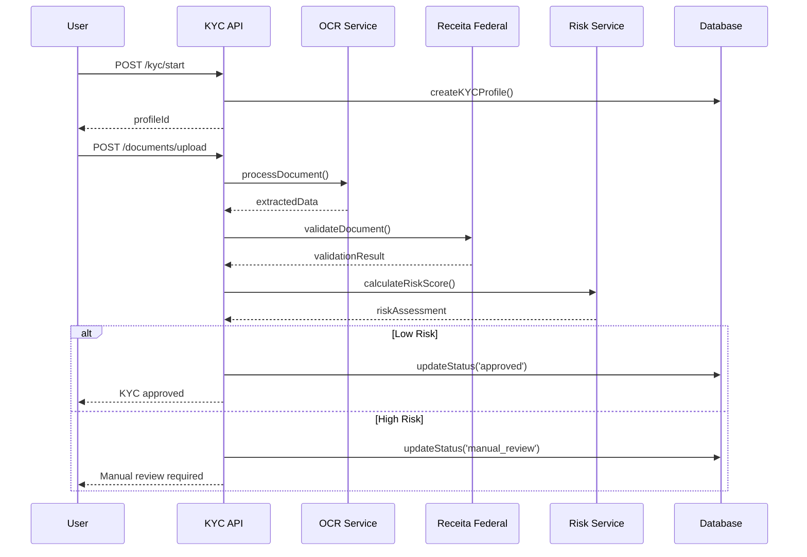

# ARQUITETURA KYC/ONBOARDING - VISANETPAY
## Data: 21/08/2024 - Arquiteto: Bob

---

## 🎯 VISÃO GERAL
Sistema KYC (Know Your Customer) completo com validação automática de documentos, score de risco, compliance AML/CFT e processo de onboarding otimizado.

---

## 📊 ESTRUTURA DE DADOS

### **Tabela: kyc_profiles**
```sql
CREATE TABLE kyc_profiles (
  id UUID PRIMARY KEY DEFAULT gen_random_uuid(),
  user_id UUID REFERENCES auth.users(id) UNIQUE,
  document_type VARCHAR(20) NOT NULL CHECK (document_type IN ('CPF', 'CNPJ', 'PASSPORT', 'RG')),
  document_number VARCHAR(20) NOT NULL,
  full_name VARCHAR(100) NOT NULL,
  birth_date DATE,
  nationality VARCHAR(3) DEFAULT 'BRA',
  occupation VARCHAR(100),
  income_range VARCHAR(20) CHECK (income_range IN ('0-2K', '2K-5K', '5K-10K', '10K-20K', '20K+')),
  address JSONB NOT NULL,
  phone_verified BOOLEAN DEFAULT false,
  email_verified BOOLEAN DEFAULT false,
  kyc_status VARCHAR(20) DEFAULT 'pending' CHECK (kyc_status IN ('pending', 'in_review', 'approved', 'rejected', 'requires_update')),
  risk_score INTEGER CHECK (risk_score BETWEEN 0 AND 100),
  risk_level VARCHAR(10) CHECK (risk_level IN ('LOW', 'MEDIUM', 'HIGH')),
  approved_at TIMESTAMP,
  approved_by UUID REFERENCES auth.users(id),
  rejection_reason TEXT,
  created_at TIMESTAMP DEFAULT NOW(),
  updated_at TIMESTAMP DEFAULT NOW()
);

CREATE INDEX idx_kyc_profiles_user_id ON kyc_profiles(user_id);
CREATE INDEX idx_kyc_profiles_status ON kyc_profiles(kyc_status);
CREATE INDEX idx_kyc_profiles_document ON kyc_profiles(document_number);
```

### **Tabela: kyc_documents**
```sql
CREATE TABLE kyc_documents (
  id UUID PRIMARY KEY DEFAULT gen_random_uuid(),
  kyc_profile_id UUID REFERENCES kyc_profiles(id),
  document_type VARCHAR(30) NOT NULL CHECK (document_type IN ('ID_FRONT', 'ID_BACK', 'PROOF_ADDRESS', 'SELFIE', 'INCOME_PROOF')),
  file_url TEXT NOT NULL,
  file_size INTEGER,
  mime_type VARCHAR(50),
  ocr_data JSONB,
  verification_status VARCHAR(20) DEFAULT 'pending' CHECK (verification_status IN ('pending', 'processing', 'verified', 'failed', 'rejected')),
  verification_score DECIMAL(3,2),
  verification_details JSONB,
  uploaded_at TIMESTAMP DEFAULT NOW(),
  verified_at TIMESTAMP
);

CREATE INDEX idx_kyc_documents_profile ON kyc_documents(kyc_profile_id);
CREATE INDEX idx_kyc_documents_type ON kyc_documents(document_type);
```

### **Tabela: risk_assessments**
```sql
CREATE TABLE risk_assessments (
  id UUID PRIMARY KEY DEFAULT gen_random_uuid(),
  kyc_profile_id UUID REFERENCES kyc_profiles(id),
  assessment_type VARCHAR(20) DEFAULT 'onboarding' CHECK (assessment_type IN ('onboarding', 'periodic', 'transaction')),
  factors JSONB NOT NULL,
  total_score INTEGER NOT NULL,
  risk_level VARCHAR(10) NOT NULL,
  recommendations TEXT[],
  assessed_by VARCHAR(20) DEFAULT 'system',
  created_at TIMESTAMP DEFAULT NOW()
);
```

---

## 🔌 API ENDPOINTS

### **KYC Management**
```typescript
// Iniciar processo KYC
POST /api/kyc/start
{
  documentType: 'CPF' | 'CNPJ' | 'PASSPORT',
  documentNumber: string,
  fullName: string,
  birthDate: string,
  address: {
    street: string,
    city: string,
    state: string,
    zipCode: string,
    country: string
  }
}

// Upload documento
POST /api/kyc/documents/upload
{
  profileId: string,
  documentType: 'ID_FRONT' | 'ID_BACK' | 'PROOF_ADDRESS' | 'SELFIE',
  file: File
}

// Consultar status KYC
GET /api/kyc/status/:profileId
```

---

## 🔍 VALIDAÇÃO AUTOMÁTICA

### **Validador CPF/CNPJ**
```typescript
class DocumentValidator {
  static validateCPF(cpf: string): boolean {
    const cleanCPF = cpf.replace(/\D/g, '');
    if (cleanCPF.length !== 11) return false;
    
    // Verificar sequências inválidas
    if (/^(\d)\1{10}$/.test(cleanCPF)) return false;
    
    // Calcular dígitos verificadores
    let sum = 0;
    for (let i = 0; i < 9; i++) {
      sum += parseInt(cleanCPF[i]) * (10 - i);
    }
    
    let remainder = (sum * 10) % 11;
    if (remainder === 10 || remainder === 11) remainder = 0;
    if (remainder !== parseInt(cleanCPF[9])) return false;
    
    sum = 0;
    for (let i = 0; i < 10; i++) {
      sum += parseInt(cleanCPF[i]) * (11 - i);
    }
    
    remainder = (sum * 10) % 11;
    if (remainder === 10 || remainder === 11) remainder = 0;
    
    return remainder === parseInt(cleanCPF[10]);
  }

  static validateCNPJ(cnpj: string): boolean {
    const cleanCNPJ = cnpj.replace(/\D/g, '');
    if (cleanCNPJ.length !== 14) return false;
    
    const weights1 = [5, 4, 3, 2, 9, 8, 7, 6, 5, 4, 3, 2];
    const weights2 = [6, 5, 4, 3, 2, 9, 8, 7, 6, 5, 4, 3, 2];
    
    const calculateDigit = (cnpj: string, weights: number[]) => {
      const sum = cnpj.split('').reduce((acc, digit, index) => {
        return acc + parseInt(digit) * weights[index];
      }, 0);
      
      const remainder = sum % 11;
      return remainder < 2 ? 0 : 11 - remainder;
    };
    
    const digit1 = calculateDigit(cleanCNPJ.slice(0, 12), weights1);
    const digit2 = calculateDigit(cleanCNPJ.slice(0, 13), weights2);
    
    return digit1 === parseInt(cleanCNPJ[12]) && digit2 === parseInt(cleanCNPJ[13]);
  }

  static async validateWithReceitaFederal(document: string, type: 'CPF' | 'CNPJ'): Promise<ValidationResult> {
    // Simulação - em produção integraria com API da Receita Federal
    const mockValidation = {
      valid: Math.random() > 0.1, // 90% válidos para simulação
      name: type === 'CPF' ? 'João Silva Santos' : 'Empresa LTDA',
      status: 'REGULAR',
      details: {
        birthDate: type === 'CPF' ? '1990-05-15' : null,
        registrationDate: type === 'CNPJ' ? '2020-01-10' : null
      }
    };
    
    return mockValidation;
  }
}
```

### **OCR e Verificação de Documentos**
```typescript
class DocumentOCRService {
  async processDocument(fileUrl: string, documentType: string): Promise<OCRResult> {
    // Simulação OCR - em produção usaria AWS Textract ou similar
    const ocrResults = {
      ID_FRONT: {
        documentNumber: this.extractDocumentNumber(),
        fullName: 'JOÃO SILVA SANTOS',
        birthDate: '15/05/1990',
        issueDate: '10/01/2020',
        expiryDate: '10/01/2030',
        confidence: 0.95
      },
      PROOF_ADDRESS: {
        fullName: 'João Silva Santos',
        address: 'Rua das Flores, 123 - Centro',
        city: 'São Paulo',
        state: 'SP',
        zipCode: '01234-567',
        issueDate: '15/07/2024',
        confidence: 0.88
      }
    };
    
    return ocrResults[documentType] || { error: 'Document type not supported' };
  }

  async verifyDocumentAuthenticity(fileUrl: string): Promise<AuthenticityResult> {
    // Verificações de autenticidade
    const checks = {
      hasWatermark: Math.random() > 0.2,
      hasSecurityFeatures: Math.random() > 0.1,
      qualityScore: Math.random() * 0.3 + 0.7, // 0.7-1.0
      tamperingDetected: Math.random() < 0.05 // 5% chance
    };
    
    const authenticity = !checks.tamperingDetected && 
                        checks.hasWatermark && 
                        checks.qualityScore > 0.8;
    
    return {
      isAuthentic: authenticity,
      confidence: checks.qualityScore,
      details: checks
    };
  }
}
```

---

## 📊 SISTEMA DE SCORE DE RISCO

### **Calculadora de Risco**
```typescript
class RiskScoreCalculator {
  calculateOnboardingRisk(profile: KYCProfile, documents: KYCDocument[]): RiskAssessment {
    let score = 0;
    const factors = [];
    
    // 1. Qualidade dos documentos (0-25 pontos)
    const docQuality = this.assessDocumentQuality(documents);
    score += docQuality.score;
    factors.push({ factor: 'document_quality', score: docQuality.score, details: docQuality.details });
    
    // 2. Dados pessoais (0-20 pontos)
    const personalData = this.assessPersonalData(profile);
    score += personalData.score;
    factors.push({ factor: 'personal_data', score: personalData.score, details: personalData.details });
    
    // 3. Verificações externas (0-25 pontos)
    const externalChecks = this.assessExternalVerifications(profile);
    score += externalChecks.score;
    factors.push({ factor: 'external_verification', score: externalChecks.score, details: externalChecks.details });
    
    // 4. Comportamento suspeito (0-30 pontos)
    const behaviorFlags = this.assessSuspiciousBehavior(profile);
    score += behaviorFlags.score;
    factors.push({ factor: 'behavior_flags', score: behaviorFlags.score, details: behaviorFlags.details });
    
    const riskLevel = this.determineRiskLevel(score);
    
    return {
      totalScore: score,
      riskLevel,
      factors,
      recommendations: this.generateRecommendations(score, factors)
    };
  }

  private assessDocumentQuality(documents: KYCDocument[]): ScoreResult {
    let qualityScore = 0;
    const details: string[] = [];
    
    documents.forEach(doc => {
      if (doc.verification_score > 0.9) {
        qualityScore += 5;
        details.push(`High quality ${doc.document_type}`);
      } else if (doc.verification_score > 0.7) {
        qualityScore += 3;
        details.push(`Good quality ${doc.document_type}`);
      } else {
        qualityScore += 10; // Penalidade por baixa qualidade
        details.push(`Poor quality ${doc.document_type} - risk factor`);
      }
    });
    
    return { score: Math.min(qualityScore, 25), details };
  }

  private assessSuspiciousBehavior(profile: KYCProfile): ScoreResult {
    let suspicionScore = 0;
    const details: string[] = [];
    
    // Múltiplas tentativas de cadastro
    if (this.hasMultipleAttempts(profile.document_number)) {
      suspicionScore += 15;
      details.push('Multiple registration attempts detected');
    }
    
    // Dados inconsistentes
    if (this.hasInconsistentData(profile)) {
      suspicionScore += 10;
      details.push('Inconsistent personal data');
    }
    
    // Localização suspeita
    if (this.isSuspiciousLocation(profile.address)) {
      suspicionScore += 5;
      details.push('Suspicious geographic location');
    }
    
    return { score: suspicionScore, details };
  }

  private determineRiskLevel(score: number): string {
    if (score <= 30) return 'LOW';
    if (score <= 60) return 'MEDIUM';
    return 'HIGH';
  }

  private generateRecommendations(score: number, factors: any[]): string[] {
    const recommendations: string[] = [];
    
    if (score > 60) {
      recommendations.push('MANUAL_REVIEW_REQUIRED');
      recommendations.push('ADDITIONAL_DOCUMENTATION');
    } else if (score > 30) {
      recommendations.push('ENHANCED_MONITORING');
      recommendations.push('PERIODIC_REVIEW');
    } else {
      recommendations.push('STANDARD_MONITORING');
      recommendations.push('AUTO_APPROVE');
    }
    
    return recommendations;
  }
}
```

---

## 🔄 FLUXO COMPLETO KYC

### **Processo de Onboarding**


---

## ⚡ EDGE FUNCTIONS

### **kyc-processor.ts**
```typescript
import { serve } from "https://deno.land/std@0.168.0/http/server.ts";

serve(async (req) => {
  const { action, profileId, ...data } = await req.json();
  
  try {
    switch (action) {
      case 'validate_document':
        return await validateDocument(data.documentNumber, data.documentType);
        
      case 'process_ocr':
        return await processOCRDocument(data.fileUrl, data.documentType);
        
      case 'calculate_risk':
        return await calculateRiskScore(profileId);
        
      case 'approve_kyc':
        return await approveKYC(profileId, data.approvedBy);
        
      default:
        throw new Error('Invalid action');
    }
  } catch (error) {
    return new Response(JSON.stringify({ error: error.message }), {
      status: 400
    });
  }
});

async function validateDocument(documentNumber: string, type: 'CPF' | 'CNPJ') {
  // Validação algoritmo
  const isValid = type === 'CPF' ? 
    validateCPF(documentNumber) : 
    validateCNPJ(documentNumber);
  
  if (!isValid) {
    return { valid: false, error: 'Invalid document format' };
  }
  
  // Consulta Receita Federal (simulada)
  const rfValidation = await simulateReceitaFederalQuery(documentNumber, type);
  
  return {
    valid: rfValidation.valid,
    details: rfValidation.details,
    status: rfValidation.status
  };
}

async function calculateRiskScore(profileId: string) {
  const profile = await getKYCProfile(profileId);
  const documents = await getKYCDocuments(profileId);
  
  const riskCalculator = new RiskScoreCalculator();
  const assessment = riskCalculator.calculateOnboardingRisk(profile, documents);
  
  // Salvar assessment
  await saveRiskAssessment(profileId, assessment);
  
  return {
    riskScore: assessment.totalScore,
    riskLevel: assessment.riskLevel,
    recommendations: assessment.recommendations
  };
}
```

---

## 🎯 COMPLIANCE AML/CFT

### **Anti-Money Laundering**
```typescript
class AMLComplianceService {
  async performAMLChecks(profile: KYCProfile): Promise<AMLResult> {
    const checks = [];
    
    // 1. PEP (Politically Exposed Person) Check
    const pepCheck = await this.checkPEPDatabase(profile.full_name);
    checks.push({ type: 'PEP', result: pepCheck });
    
    // 2. Sanctions List Check
    const sanctionsCheck = await this.checkSanctionsList(profile.full_name, profile.document_number);
    checks.push({ type: 'SANCTIONS', result: sanctionsCheck });
    
    // 3. Adverse Media Check
    const mediaCheck = await this.checkAdverseMedia(profile.full_name);
    checks.push({ type: 'ADVERSE_MEDIA', result: mediaCheck });
    
    // 4. High-Risk Countries
    const countryRisk = this.assessCountryRisk(profile.nationality);
    checks.push({ type: 'COUNTRY_RISK', result: countryRisk });
    
    const overallRisk = this.calculateAMLRisk(checks);
    
    return {
      checks,
      overallRisk,
      recommendation: overallRisk > 70 ? 'REJECT' : overallRisk > 40 ? 'ENHANCED_DUE_DILIGENCE' : 'APPROVE'
    };
  }

  private async checkPEPDatabase(fullName: string): Promise<PEPResult> {
    // Simulação - em produção integraria com base PEP
    return {
      isMatch: Math.random() < 0.02, // 2% chance
      confidence: 0.85,
      details: fullName.includes('SILVA') ? 'Possible match in local PEP database' : null
    };
  }
}
```

---

**STATUS: Arquitetura KYC/Onboarding completa com compliance AML/CFT**