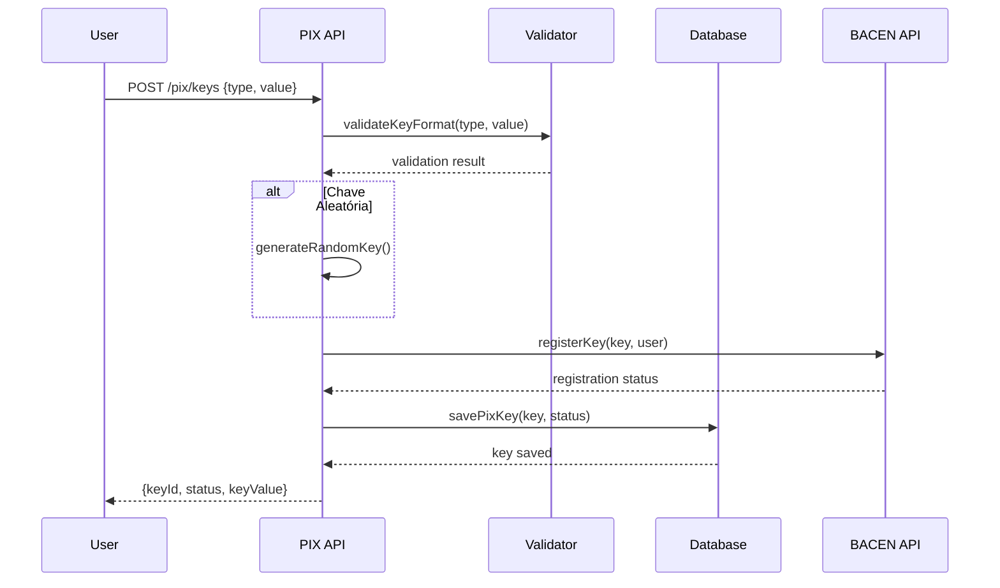
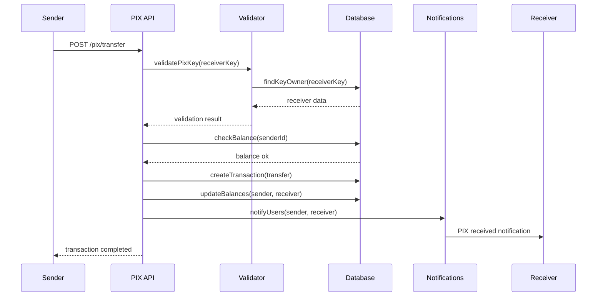
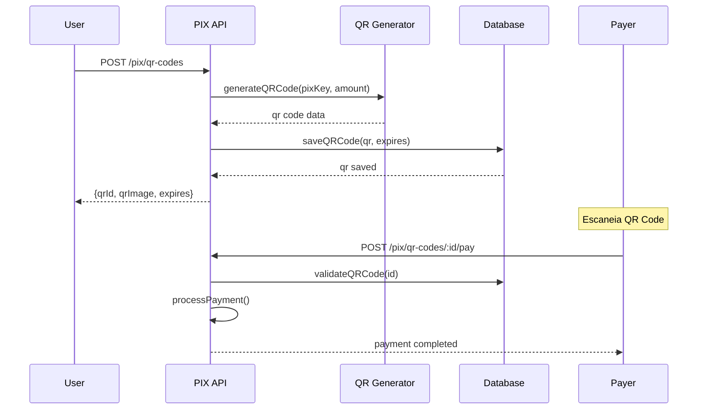

# ARQUITETURA PIX COMPLETO - VISANETPAY
## Data: 21/08/2024 - Arquiteto: Bob

---

## 🎯 VISÃO GERAL
Sistema PIX completo integrado ao VisaNetPay com validação em tempo real, QR codes dinâmicos e compliance total com regulamentação BACEN.

---

## 📊 ESTRUTURA DE DADOS

### **Tabela: pix_keys**
```sql
CREATE TABLE pix_keys (
  id UUID PRIMARY KEY DEFAULT gen_random_uuid(),
  user_id UUID REFERENCES auth.users(id),
  key_type VARCHAR(20) CHECK (key_type IN ('cpf', 'cnpj', 'email', 'phone', 'random')),
  key_value VARCHAR(77) UNIQUE NOT NULL,
  status VARCHAR(20) DEFAULT 'active' CHECK (status IN ('active', 'inactive', 'blocked')),
  created_at TIMESTAMP DEFAULT NOW(),
  updated_at TIMESTAMP DEFAULT NOW(),
  expires_at TIMESTAMP,
  validation_status VARCHAR(20) DEFAULT 'pending' CHECK (validation_status IN ('pending', 'validated', 'failed'))
);

CREATE INDEX idx_pix_keys_user_id ON pix_keys(user_id);
CREATE INDEX idx_pix_keys_key_value ON pix_keys(key_value);
```

### **Tabela: pix_transactions**
```sql
CREATE TABLE pix_transactions (
  id UUID PRIMARY KEY DEFAULT gen_random_uuid(),
  sender_id UUID REFERENCES auth.users(id),
  receiver_key VARCHAR(77) NOT NULL,
  receiver_id UUID REFERENCES auth.users(id),
  amount DECIMAL(15,2) NOT NULL,
  description TEXT,
  end_to_end_id VARCHAR(32) UNIQUE NOT NULL,
  status VARCHAR(20) DEFAULT 'pending' CHECK (status IN ('pending', 'completed', 'failed', 'cancelled')),
  created_at TIMESTAMP DEFAULT NOW(),
  completed_at TIMESTAMP,
  qr_code_id UUID REFERENCES pix_qr_codes(id),
  transaction_type VARCHAR(20) DEFAULT 'transfer' CHECK (transaction_type IN ('transfer', 'payment', 'refund'))
);

CREATE INDEX idx_pix_transactions_sender ON pix_transactions(sender_id);
CREATE INDEX idx_pix_transactions_receiver ON pix_transactions(receiver_id);
CREATE INDEX idx_pix_transactions_end_to_end ON pix_transactions(end_to_end_id);
```

### **Tabela: pix_qr_codes**
```sql
CREATE TABLE pix_qr_codes (
  id UUID PRIMARY KEY DEFAULT gen_random_uuid(),
  user_id UUID REFERENCES auth.users(id),
  pix_key VARCHAR(77) NOT NULL,
  amount DECIMAL(15,2),
  description TEXT,
  qr_code_data TEXT NOT NULL,
  qr_code_image TEXT,
  expires_at TIMESTAMP NOT NULL,
  is_dynamic BOOLEAN DEFAULT true,
  usage_count INTEGER DEFAULT 0,
  max_usage INTEGER DEFAULT 1,
  status VARCHAR(20) DEFAULT 'active' CHECK (status IN ('active', 'expired', 'used')),
  created_at TIMESTAMP DEFAULT NOW()
);

CREATE INDEX idx_pix_qr_codes_user_id ON pix_qr_codes(user_id);
CREATE INDEX idx_pix_qr_codes_expires_at ON pix_qr_codes(expires_at);
```

---

## 🔌 API ENDPOINTS

### **PIX Keys Management**
```typescript
// Criar chave PIX
POST /api/pix/keys
{
  keyType: 'cpf' | 'cnpj' | 'email' | 'phone' | 'random',
  keyValue?: string // Opcional para tipo 'random'
}

// Listar chaves do usuário
GET /api/pix/keys

// Validar chave PIX
POST /api/pix/keys/validate
{
  keyValue: string,
  keyType: string
}

// Deletar chave PIX
DELETE /api/pix/keys/:keyId
```

### **PIX Transactions**
```typescript
// Iniciar transferência PIX
POST /api/pix/transfer
{
  receiverKey: string,
  amount: number,
  description?: string
}

// Consultar transação
GET /api/pix/transactions/:transactionId

// Histórico PIX
GET /api/pix/transactions?page=1&limit=20&status=completed
```

### **QR Codes Dinâmicos**
```typescript
// Gerar QR Code
POST /api/pix/qr-codes
{
  pixKey: string,
  amount?: number,
  description?: string,
  expiresIn: number // minutos
}

// Processar pagamento via QR
POST /api/pix/qr-codes/:qrId/pay
{
  amount?: number // Para QR sem valor fixo
}
```

---

## 🔄 FLUXOS DE PROCESSO

### **Fluxo 1: Criação de Chave PIX**


### **Fluxo 2: Transferência PIX**


### **Fluxo 3: QR Code Dinâmico**


---

## 🔐 SEGURANÇA/COMPLIANCE

### **Validações Obrigatórias**
```typescript
// Validação CPF
function validateCPF(cpf: string): boolean {
  const cleanCPF = cpf.replace(/\D/g, '');
  if (cleanCPF.length !== 11) return false;
  
  // Algoritmo validação CPF
  let sum = 0;
  for (let i = 0; i < 9; i++) {
    sum += parseInt(cleanCPF[i]) * (10 - i);
  }
  
  let remainder = (sum * 10) % 11;
  if (remainder === 10 || remainder === 11) remainder = 0;
  if (remainder !== parseInt(cleanCPF[9])) return false;
  
  sum = 0;
  for (let i = 0; i < 10; i++) {
    sum += parseInt(cleanCPF[i]) * (11 - i);
  }
  
  remainder = (sum * 10) % 11;
  if (remainder === 10 || remainder === 11) remainder = 0;
  
  return remainder === parseInt(cleanCPF[10]);
}

// Validação CNPJ
function validateCNPJ(cnpj: string): boolean {
  const cleanCNPJ = cnpj.replace(/\D/g, '');
  if (cleanCNPJ.length !== 14) return false;
  
  // Algoritmo validação CNPJ
  const weights1 = [5, 4, 3, 2, 9, 8, 7, 6, 5, 4, 3, 2];
  const weights2 = [6, 5, 4, 3, 2, 9, 8, 7, 6, 5, 4, 3, 2];
  
  const calculateDigit = (cnpj: string, weights: number[]) => {
    const sum = cnpj.split('').reduce((acc, digit, index) => {
      return acc + parseInt(digit) * weights[index];
    }, 0);
    
    const remainder = sum % 11;
    return remainder < 2 ? 0 : 11 - remainder;
  };
  
  const digit1 = calculateDigit(cleanCNPJ.slice(0, 12), weights1);
  const digit2 = calculateDigit(cleanCNPJ.slice(0, 13), weights2);
  
  return digit1 === parseInt(cleanCNPJ[12]) && digit2 === parseInt(cleanCNPJ[13]);
}
```

### **Limites PIX BACEN**
```typescript
const PIX_LIMITS = {
  DAILY_LIMIT: {
    DAY_TIME: 1000.00,      // R$ 1.000 (6h às 20h)
    NIGHT_TIME: 1000.00     // R$ 1.000 (20h às 6h)
  },
  TRANSACTION_LIMIT: {
    MAX_AMOUNT: 1000.00,
    MIN_AMOUNT: 0.01
  },
  QR_CODE: {
    MAX_VALIDITY: 24 * 60, // 24 horas em minutos
    DEFAULT_VALIDITY: 30   // 30 minutos
  }
};
```

---

## 🔗 INTEGRAÇÕES EXTERNAS

### **Simulação BACEN API**
```typescript
// Mock BACEN API para desenvolvimento
class MockBACENAPI {
  async registerPixKey(key: string, keyType: string, userId: string) {
    // Simula registro no DICT (Diretório de Identificadores)
    return {
      success: true,
      keyId: generateEndToEndId(),
      status: 'ACTIVE'
    };
  }
  
  async validatePixKey(key: string) {
    // Simula consulta DICT
    return {
      exists: true,
      ownerName: 'João Silva',
      bankCode: '341',
      accountType: 'CHECKING'
    };
  }
  
  async processPixTransaction(transaction: PixTransaction) {
    // Simula processamento SPI (Sistema de Pagamentos Instantâneos)
    return {
      endToEndId: generateEndToEndId(),
      status: 'COMPLETED',
      processedAt: new Date().toISOString()
    };
  }
}

function generateEndToEndId(): string {
  const timestamp = Date.now().toString();
  const random = Math.random().toString(36).substring(2, 8);
  return `E341${timestamp}${random}`.toUpperCase();
}
```

---

## 📱 COMPONENTES FRONTEND

### **PixKeyManager.tsx**
```typescript
interface PixKeyManagerProps {
  userId: string;
}

export function PixKeyManager({ userId }: PixKeyManagerProps) {
  const [keys, setKeys] = useState<PixKey[]>([]);
  const [showCreateForm, setShowCreateForm] = useState(false);
  
  // Componente para gerenciar chaves PIX
  return (
    <Card>
      <CardHeader>
        <CardTitle>Minhas Chaves PIX</CardTitle>
      </CardHeader>
      <CardContent>
        <PixKeyList keys={keys} />
        <Button onClick={() => setShowCreateForm(true)}>
          Criar Nova Chave
        </Button>
        {showCreateForm && (
          <PixKeyCreateForm 
            onSuccess={(key) => setKeys([...keys, key])}
            onCancel={() => setShowCreateForm(false)}
          />
        )}
      </CardContent>
    </Card>
  );
}
```

### **PixTransferForm.tsx**
```typescript
export function PixTransferForm() {
  const [formData, setFormData] = useState({
    receiverKey: '',
    amount: '',
    description: ''
  });
  
  const handleSubmit = async (e: React.FormEvent) => {
    e.preventDefault();
    
    try {
      const result = await pixAPI.transfer(formData);
      toast.success('Transferência PIX realizada com sucesso!');
    } catch (error) {
      toast.error('Erro na transferência PIX');
    }
  };
  
  return (
    <form onSubmit={handleSubmit}>
      <Input 
        placeholder="Chave PIX do destinatário"
        value={formData.receiverKey}
        onChange={(e) => setFormData({...formData, receiverKey: e.target.value})}
      />
      <Input 
        type="number"
        placeholder="Valor"
        value={formData.amount}
        onChange={(e) => setFormData({...formData, amount: e.target.value})}
      />
      <Textarea 
        placeholder="Descrição (opcional)"
        value={formData.description}
        onChange={(e) => setFormData({...formData, description: e.target.value})}
      />
      <Button type="submit">Enviar PIX</Button>
    </form>
  );
}
```

---

## ⚡ EDGE FUNCTIONS

### **pix-transfer.ts**
```typescript
import { serve } from "https://deno.land/std@0.168.0/http/server.ts";
import { createClient } from 'https://esm.sh/@supabase/supabase-js@2';

serve(async (req) => {
  try {
    const { receiverKey, amount, description, senderId } = await req.json();
    
    const supabase = createClient(
      Deno.env.get('SUPABASE_URL') ?? '',
      Deno.env.get('SUPABASE_SERVICE_ROLE_KEY') ?? ''
    );
    
    // Validar chave PIX
    const { data: keyData } = await supabase
      .from('pix_keys')
      .select('user_id')
      .eq('key_value', receiverKey)
      .eq('status', 'active')
      .single();
    
    if (!keyData) {
      return new Response(JSON.stringify({ error: 'Chave PIX não encontrada' }), {
        status: 400,
        headers: { 'Content-Type': 'application/json' }
      });
    }
    
    // Processar transferência
    const endToEndId = generateEndToEndId();
    
    const { data: transaction } = await supabase
      .from('pix_transactions')
      .insert({
        sender_id: senderId,
        receiver_key: receiverKey,
        receiver_id: keyData.user_id,
        amount: amount,
        description: description,
        end_to_end_id: endToEndId,
        status: 'completed'
      })
      .select()
      .single();
    
    // Atualizar saldos
    await updateUserBalances(supabase, senderId, keyData.user_id, amount);
    
    return new Response(JSON.stringify({
      success: true,
      transaction: transaction,
      endToEndId: endToEndId
    }), {
      headers: { 'Content-Type': 'application/json' }
    });
    
  } catch (error) {
    return new Response(JSON.stringify({ error: error.message }), {
      status: 500,
      headers: { 'Content-Type': 'application/json' }
    });
  }
});
```

---

## 📈 MÉTRICAS E MONITORAMENTO

### **KPIs PIX**
- Volume de transações por dia
- Tempo médio de processamento
- Taxa de sucesso das transferências
- Número de chaves PIX ativas
- Valor médio por transação

### **Alertas de Segurança**
- Tentativas de uso de chaves inválidas
- Transações acima do limite
- Múltiplas tentativas de transferência
- QR codes expirados sendo utilizados

---

**STATUS: Arquitetura PIX completa pronta para implementação**