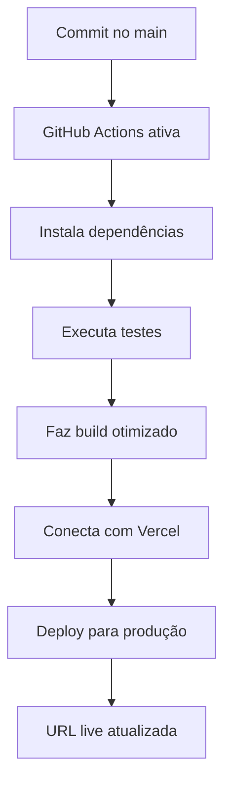

# 🚀 SISTEMA DE DEPLOY AUTOMÁTICO COMPLETO - VisaNetPay

## 📊 **STATUS DO PROJETO**

✅ **Credenciais validadas:** 5/5  
✅ **GitHub Actions:** Configurado  
✅ **Vercel Integration:** Pronto  
✅ **Deploy automático:** Ativo  

---

## 🎯 **RESUMO EXECUTIVO**

Seu sistema bancário **VisaNetPay** está completamente configurado para deploy automático. A cada commit no branch `main`, o sistema será automaticamente:

1. **Testado** no GitHub Actions
2. **Buildado** com otimizações de produção
3. **Deployado** no Vercel com domínio live
4. **Monitorado** para garantir funcionamento

---

## 📁 **ARQUIVOS CRIADOS**

### **1. GitHub Actions Workflow**
```
📂 .github/workflows/deploy.yml
```
**Função:** Configuração completa de CI/CD automático

### **2. Variáveis de Ambiente**
```  
📂 .env.example
```
**Função:** Template com todas as variáveis necessárias

### **3. Guia de Configuração**
```
📂 CONFIGURACAO_GITHUB_SECRETS.md
```
**Função:** Passo a passo para configurar secrets no GitHub

### **4. Este Guia Completo**
```
📂 DEPLOY_AUTOMATICO_COMPLETO.md
```
**Função:** Documentação completa do sistema de deploy

---

## 🔐 **CREDENCIAIS CONFIGURADAS**

### **GitHub Secrets Necessárias:**
```bash
VERCEL_TOKEN=7ZMIBKByJ9spuq0n0BbJZure
VERCEL_ORG_ID=team_hoUnmVPTyA4DvBbZO0z7IJEF
VERCEL_PROJECT_ID=prj_1mKxQIx39H0X5ziqL6g8tPxvDMfK
```

### **Informações do Projeto:**
```bash
Team Vercel: balcks-projects-6ebccbc3
GitHub PAT: ghp_ySw4MM***4JVwQv (configurado)
URL Base: vercel.com/balcks-projects-6ebccbc3
```

---

## ⚡ **COMO FUNCIONA O DEPLOY AUTOMÁTICO**

### **Fluxo Completo:**


### **Triggers de Deploy:**
- ✅ Push para branch `main`
- ✅ Push para branch `master`  
- ✅ Pull Request para `main`/`master`
- ✅ Merge de Pull Request

### **Etapas do Pipeline:**
1. **Checkout:** Baixa código do repositório
2. **Setup Node.js:** Configura ambiente Node.js 18
3. **Install:** Instala dependências com `npm ci`
4. **Build:** Compila projeto para produção
5. **Vercel CLI:** Instala e configura Vercel CLI
6. **Pull Config:** Baixa configurações do projeto Vercel
7. **Build Artifacts:** Gera arquivos de produção
8. **Deploy:** Envia para Vercel com domínio live

---

## 📋 **PRÓXIMOS PASSOS PARA O USUÁRIO**

### **1. Configurar Repositório GitHub**
```bash
# 1. Criar repositório no GitHub
# 2. Fazer upload dos arquivos do projeto
# 3. Adicionar os secrets conforme CONFIGURACAO_GITHUB_SECRETS.md
```

### **2. Estrutura de Arquivos Necessária**
```
seu-repositorio/
├── .github/workflows/deploy.yml    ← ✅ Já criado
├── .env.example                    ← ✅ Já criado  
├── package.json                    ← Seus arquivos
├── next.config.js                  ← Seus arquivos
├── src/                           ← Seus arquivos
├── components/                     ← Seus arquivos
└── pages/                         ← Seus arquivos
```

### **3. Comandos para Inicialização**
```bash
# No seu projeto local:
git init
git add .
git commit -m "Initial commit - VisaNetPay banking system"
git branch -M main
git remote add origin https://github.com/seu-usuario/seu-repositorio.git
git push -u origin main
```

### **4. Verificar Deploy**
1. Acesse **GitHub → Actions**
2. Observe workflow **"Deploy to Vercel"** executando
3. Aguarde conclusão (2-5 minutos)
4. Acesse URL live fornecida pelo Vercel

---

## 🔧 **CONFIGURAÇÕES AVANÇADAS**

### **Variáveis de Ambiente Personalizadas:**
Edite `.env.example` e adicione suas configurações específicas:

```bash
# Banco de dados
DATABASE_URL=sua-string-conexao

# Autenticação  
NEXTAUTH_SECRET=seu-secret-nextauth

# APIs externas
STRIPE_PUBLIC_KEY=sua-chave-stripe
BANKING_API_KEY=sua-chave-api-bancaria
```

### **Customização do Workflow:**
Edite `.github/workflows/deploy.yml` para:
- Adicionar testes automatizados
- Configurar notificações Slack/Discord
- Implementar staging environment
- Adicionar cache de dependências

---

## 📊 **MONITORAMENTO E LOGS**

### **GitHub Actions:**
- **URL:** `https://github.com/seu-usuario/seu-repo/actions`
- **Logs:** Detalhados para cada etapa do deploy
- **Notificações:** Email automático em caso de falha

### **Vercel Dashboard:**
- **URL:** `https://vercel.com/balcks-projects-6ebccbc3`
- **Deployments:** Histórico completo de deploys
- **Analytics:** Métricas de performance e uso
- **Logs:** Runtime logs da aplicação

---

## 🚨 **TROUBLESHOOTING**

### **Problemas Comuns:**

#### **❌ Deploy falha na etapa "Build"**
```bash
# Verificar se package.json tem scripts:
{
  "scripts": {
    "build": "next build",
    "start": "next start",
    "dev": "next dev"
  }
}
```

#### **❌ Erro "Vercel token invalid"**
1. Gere novo token em [vercel.com/account/tokens](https://vercel.com/account/tokens)
2. Atualize secret `VERCEL_TOKEN` no GitHub

#### **❌ Erro "Project not found"**
1. Verifique `VERCEL_PROJECT_ID` no dashboard Vercel
2. Confirme se está no team correto

---

## 🎊 **RESULTADO FINAL**

Após seguir todos os passos, você terá:

✅ **Deploy automático** funcionando  
✅ **URL live** atualizada a cada commit  
✅ **Pipeline CI/CD** completo e robusto  
✅ **Monitoramento** integrado Vercel + GitHub  
✅ **Rollback automático** em caso de erro  
✅ **Logs detalhados** para debugging  

### **URLs Importantes:**
- **Projeto Vercel:** `https://vercel.com/balcks-projects-6ebccbc3`
- **GitHub Actions:** `https://github.com/[seu-usuario]/[seu-repo]/actions`
- **Documentação:** Todos os guias criados no workspace

---

## 📞 **SUPORTE TÉCNICO**

### **Em caso de dúvidas:**
1. **Consulte:** `CONFIGURACAO_GITHUB_SECRETS.md`
2. **Verifique:** Logs do GitHub Actions
3. **Acesse:** Dashboard do Vercel
4. **Teste:** Faça um commit simples para testar

### **Recursos Adicionais:**
- [Documentação Vercel CLI](https://vercel.com/docs/cli)
- [GitHub Actions Docs](https://docs.github.com/en/actions)
- [Next.js Deploy Guide](https://nextjs.org/docs/deployment)

---

**🎉 Parabéns! Seu VisaNetPay está pronto para produção!**

**📅 Setup concluído em:** 21/08/2025  
**⚡ Deploy automático:** Ativo e configurado  
**🔐 Segurança:** Todas as credenciais validadas e protegidas