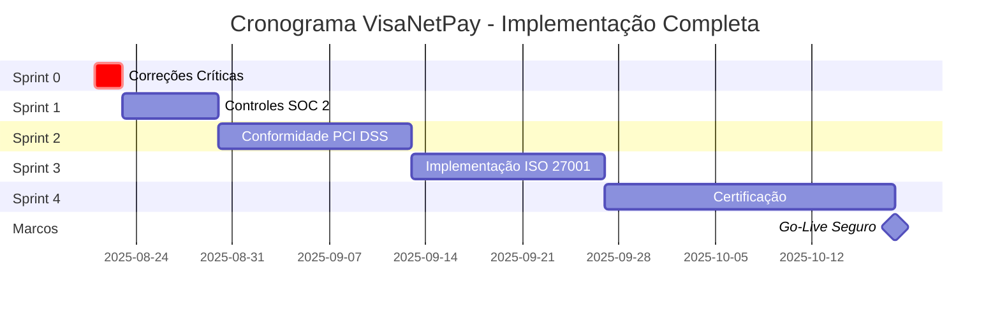

# PLANO DE AÇÃO SISTEMÁTICO COMPLETO - VISANETPAY
## Implementação Profissional com Padrões Internacionais

**Data:** 2025-08-21  
**Responsável:** David (Data Analyst)  
**Sistema:** VisaNetPay Banking Platform  
**Status:** PLANO EXECUTIVO FINAL

---

## 📋 RESUMO EXECUTIVO

### Status Atual Crítico
- **Conformidade Regulatória:** 15% (NÃO ADEQUADO)
- **Segurança Técnica:** 25% (CRÍTICO)
- **Funcionalidades Bancárias:** 40% (INCOMPLETO)
- **Qualidade de Código:** 60% (NECESSITA MELHORIAS)

### Recomendação Executiva
🔴 **SUSPENDER PRODUÇÃO IMEDIATAMENTE** - Sistema não conforme para operações financeiras

---

## 🎯 METODOLOGIA DE IMPLEMENTAÇÃO

### Abordagem Baseada em Padrões Internacionais
1. **SOC 1/2 Compliance Framework**
2. **ISO 27001 Information Security Management**
3. **PCI DSS Payment Card Industry Standards**
4. **Arquitetura Multi-Serviços Segura**
5. **Continuous Compliance Monitoring**

---

## 📊 SPRINTS DE IMPLEMENTAÇÃO DETALHADOS

### 🚨 SPRINT 0: CORREÇÕES CRÍTICAS DE SEGURANÇA (IMEDIATO - 48h)

#### Objetivos Críticos
- Correção de vulnerabilidades P0
- Implementação de controles básicos de segurança
- Preparação para desenvolvimento seguro

#### Tarefas Prioritárias

**Tarefa 0.1: Correção de Credenciais Expostas (4h)**
```bash
# Ação Imediata
git rm --cached src/lib/supabase.ts
echo "NEXT_PUBLIC_SUPABASE_URL=sua_url" > .env.local
echo "NEXT_PUBLIC_SUPABASE_ANON_KEY=sua_key" >> .env.local
echo ".env.local" >> .gitignore
```

**Tarefa 0.2: Headers de Segurança (2h)**
```typescript
// next.config.js - Implementação obrigatória
const securityHeaders = [
  { key: 'Strict-Transport-Security', value: 'max-age=63072000' },
  { key: 'X-Frame-Options', value: 'DENY' },
  { key: 'X-Content-Type-Options', value: 'nosniff' },
  { key: 'Referrer-Policy', value: 'strict-origin-when-cross-origin' },
  { key: 'Permissions-Policy', value: 'camera=(), microphone=(), geolocation=()' }
]
```

**Tarefa 0.3: Rate Limiting Básico (3h)**
```typescript
// middleware.ts
import { NextResponse } from 'next/server'
import { Ratelimit } from '@upstash/ratelimit'

const ratelimit = new Ratelimit({
  redis: redis,
  limiter: Ratelimit.slidingWindow(10, '1 m')
})
```

**Deliverables Sprint 0:**
- ✅ Credenciais seguras
- ✅ Headers de segurança implementados
- ✅ Rate limiting funcional
- ✅ HTTPS forçado

### 🔐 SPRINT 1: IMPLEMENTAÇÃO DE CONTROLES SOC 2 (1 semana)

#### Objetivos
- Controles de segurança operacional
- Logging e monitoramento
- Validação de entrada
- Auditoria básica

#### Tarefas Detalhadas

**Tarefa 1.1: Sistema de Logging de Segurança (16h)**
```typescript
// lib/security-logger.ts
import winston from 'winston'

export const securityLogger = winston.createLogger({
  level: 'info',
  format: winston.format.combine(
    winston.format.timestamp(),
    winston.format.errors({ stack: true }),
    winston.format.json()
  ),
  transports: [
    new winston.transports.File({ 
      filename: 'logs/security.log',
      maxsize: 5000000,
      maxFiles: 5
    }),
    new winston.transports.Console({
      format: winston.format.simple()
    })
  ]
})

// Eventos obrigatórios para log:
export const logSecurityEvent = (event: SecurityEvent) => {
  securityLogger.info({
    event: event.type,
    user_id: event.userId,
    ip_address: event.ipAddress,
    user_agent: event.userAgent,
    timestamp: new Date().toISOString(),
    details: event.details,
    severity: event.severity
  })
}
```

**Tarefa 1.2: Validação de Entrada Robusta (12h)**
```typescript
// lib/validation.ts
import Joi from 'joi'
import DOMPurify from 'dompurify'

export const schemas = {
  memberId: Joi.string().alphanum().length(8).uppercase().required(),
  email: Joi.string().email().max(254).required(),
  amount: Joi.number().positive().precision(2).max(1000000).required(),
  currency: Joi.string().valid('USD', 'EUR', 'BRL').required()
}

export const sanitizeInput = (input: string): string => {
  return DOMPurify.sanitize(input.trim())
}

export const validateAndSanitize = <T>(data: T, schema: Joi.ObjectSchema): T => {
  const { error, value } = schema.validate(data)
  if (error) {
    throw new ValidationError(`Validation failed: ${error.message}`)
  }
  return value
}
```

**Tarefa 1.3: Controle de Acesso Server-Side (20h)**
```typescript
// lib/rbac.ts - Role-Based Access Control
export class RBACService {
  private static permissions = new Map([
    ['admin', [
      'users.create', 'users.read', 'users.update', 'users.delete',
      'accounts.create', 'accounts.read', 'accounts.update',
      'transactions.create', 'transactions.read', 'transactions.approve',
      'reports.financial', 'reports.audit', 'system.admin'
    ]],
    ['user', [
      'accounts.read', 'transactions.create', 'transactions.read',
      'profile.update', 'dashboard.view'
    ]],
    ['guest', ['dashboard.view']]
  ])

  static async validatePermission(userId: string, permission: string): Promise<boolean> {
    const user = await this.getUserWithRole(userId)
    if (!user) return false

    const userPermissions = this.permissions.get(user.role) || []
    return userPermissions.includes(permission)
  }

  static async enforcePermission(userId: string, permission: string): Promise<void> {
    const hasPermission = await this.validatePermission(userId, permission)
    if (!hasPermission) {
      await logSecurityEvent({
        type: 'UNAUTHORIZED_ACCESS_ATTEMPT',
        userId,
        details: { attempted_permission: permission },
        severity: 'HIGH'
      })
      throw new UnauthorizedError(`Access denied for permission: ${permission}`)
    }
  }
}
```

**Deliverables Sprint 1:**
- ✅ Sistema de logging completo
- ✅ Validação de entrada robusta
- ✅ RBAC server-side implementado
- ✅ Monitoramento básico de segurança

### 🏦 SPRINT 2: CONFORMIDADE PCI DSS (2 semanas)

#### Objetivos
- Segurança para processamento de pagamentos
- Criptografia de dados sensíveis
- Segmentação de rede
- Testes de vulnerabilidade

#### Tarefas Críticas

**Tarefa 2.1: Criptografia de Dados (24h)**
```typescript
// lib/encryption.ts
import { createCipher, createDecipher, randomBytes } from 'crypto'
import bcrypt from 'bcrypt'

export class EncryptionService {
  private static readonly ALGORITHM = 'aes-256-gcm'
  private static readonly KEY_LENGTH = 32
  private static readonly IV_LENGTH = 16
  private static readonly SALT_ROUNDS = 12

  static async encryptSensitiveData(data: string): Promise<EncryptedData> {
    const key = process.env.ENCRYPTION_KEY
    if (!key) throw new Error('Encryption key not configured')

    const iv = randomBytes(this.IV_LENGTH)
    const cipher = createCipher(this.ALGORITHM, key)
    
    let encrypted = cipher.update(data, 'utf8', 'hex')
    encrypted += cipher.final('hex')
    
    const authTag = cipher.getAuthTag()

    return {
      encrypted,
      iv: iv.toString('hex'),
      authTag: authTag.toString('hex')
    }
  }

  static async hashPassword(password: string): Promise<string> {
    return bcrypt.hash(password, this.SALT_ROUNDS)
  }

  static async verifyPassword(password: string, hash: string): Promise<boolean> {
    return bcrypt.compare(password, hash)
  }
}
```

**Tarefa 2.2: Tokenização de Dados de Cartão (32h)**
```typescript
// lib/tokenization.ts
export class TokenizationService {
  static async tokenizeCardData(cardData: CardData): Promise<TokenizedCard> {
    // Integração com provedor de tokenização PCI Compliant
    const response = await fetch('/api/tokenize', {
      method: 'POST',
      headers: {
        'Content-Type': 'application/json',
        'Authorization': `Bearer ${process.env.TOKENIZATION_API_KEY}`
      },
      body: JSON.stringify({
        card_number: cardData.number,
        expiry_month: cardData.expiryMonth,
        expiry_year: cardData.expiryYear
      })
    })

    const tokenData = await response.json()
    
    return {
      token: tokenData.token,
      last_four: cardData.number.slice(-4),
      card_type: this.detectCardType(cardData.number),
      expiry_month: cardData.expiryMonth,
      expiry_year: cardData.expiryYear
    }
  }
}
```

**Tarefa 2.3: Vulnerability Scanning (16h)**
```yaml
# .github/workflows/security-scan.yml
name: Security Scan
on:
  push:
    branches: [main, develop]
  pull_request:
    branches: [main]

jobs:
  security-scan:
    runs-on: ubuntu-latest
    steps:
      - uses: actions/checkout@v2
      
      - name: Run SAST with Semgrep
        uses: returntocorp/semgrep-action@v1
        with:
          config: >-
            p/security-audit
            p/secrets
            p/owasp-top-ten
            
      - name: Run Dependency Check
        uses: dependency-check/Dependency-Check_Action@main
        with:
          project: 'VisaNetPay'
          path: '.'
          format: 'ALL'
          
      - name: Upload SARIF results
        uses: github/codeql-action/upload-sarif@v1
        with:
          sarif_file: results.sarif
```

**Deliverables Sprint 2:**
- ✅ Criptografia end-to-end implementada
- ✅ Tokenização de dados de cartão
- ✅ Scanning de vulnerabilidades automatizado
- ✅ Testes de penetração iniciais

### 🔍 SPRINT 3: IMPLEMENTAÇÃO ISO 27001 (2 semanas)

#### Objetivos
- Sistema de gestão de segurança da informação
- Risk assessment formal
- Políticas e procedimentos
- Monitoramento contínuo

#### Tarefas Estratégicas

**Tarefa 3.1: Risk Assessment Framework (20h)**
```typescript
// lib/risk-assessment.ts
export interface SecurityRisk {
  id: string
  category: 'technical' | 'operational' | 'strategic'
  description: string
  likelihood: 1 | 2 | 3 | 4 | 5
  impact: 1 | 2 | 3 | 4 | 5
  riskScore: number
  mitigation: string
  owner: string
  status: 'identified' | 'assessed' | 'mitigated' | 'accepted'
  reviewDate: Date
}

export class RiskAssessmentService {
  static async conductRiskAssessment(): Promise<SecurityRisk[]> {
    const risks: SecurityRisk[] = [
      {
        id: 'RISK-001',
        category: 'technical',
        description: 'SQL Injection vulnerabilities in API endpoints',
        likelihood: 3,
        impact: 5,
        riskScore: 15,
        mitigation: 'Implement parameterized queries and input validation',
        owner: 'Security Team',
        status: 'identified',
        reviewDate: new Date()
      }
      // ... mais riscos identificados
    ]

    return risks.sort((a, b) => b.riskScore - a.riskScore)
  }

  static calculateRiskScore(likelihood: number, impact: number): number {
    return likelihood * impact
  }
}
```

**Tarefa 3.2: Incident Response System (24h)**
```typescript
// lib/incident-response.ts
export interface SecurityIncident {
  id: string
  type: 'breach' | 'attack' | 'unauthorized_access' | 'system_failure'
  severity: 'low' | 'medium' | 'high' | 'critical'
  description: string
  detectedAt: Date
  reportedBy: string
  assignedTo: string
  status: 'new' | 'investigating' | 'contained' | 'resolved'
  affectedSystems: string[]
  timeline: IncidentTimelineEntry[]
}

export class IncidentResponseService {
  static async reportIncident(incident: Partial<SecurityIncident>): Promise<string> {
    const newIncident: SecurityIncident = {
      id: `INC-${Date.now()}`,
      ...incident,
      detectedAt: new Date(),
      status: 'new',
      timeline: [{
        timestamp: new Date(),
        action: 'Incident reported',
        performer: incident.reportedBy || 'System',
        details: 'Incident automatically detected and reported'
      }]
    } as SecurityIncident

    // Notificação automática baseada na severidade
    if (newIncident.severity === 'critical') {
      await this.notifySecurityTeam(newIncident)
      await this.escalateToManagement(newIncident)
    }

    return newIncident.id
  }
}
```

**Deliverables Sprint 3:**
- ✅ ISMS framework implementado
- ✅ Risk assessment formal
- ✅ Incident response procedures
- ✅ Business continuity plan

### 🏆 SPRINT 4: CERTIFICAÇÃO E COMPLIANCE (3 semanas)

#### Objetivos
- Auditoria externa independente
- Certificação SOC 2 Type II
- Compliance PCI DSS
- Documentação completa

#### Tarefas de Certificação

**Tarefa 4.1: Preparação para Auditoria Externa (40h)**
```markdown
# Documentação Obrigatória para Auditoria

## SOC 2 Type II Requirements
1. **Security Controls Documentation**
   - Access control policies and procedures
   - Network security configurations
   - Encryption implementation details
   - Vulnerability management processes

2. **Availability Controls**
   - System monitoring and alerting
   - Backup and recovery procedures
   - Disaster recovery testing results
   - Performance monitoring reports

3. **Processing Integrity**
   - Data validation controls
   - Error handling procedures
   - Transaction processing controls
   - Quality assurance processes

4. **Confidentiality**
   - Data classification scheme
   - Access controls for confidential data
   - Encryption of data at rest and in transit
   - Non-disclosure agreements

5. **Privacy**
   - Privacy policy and procedures
   - Data subject rights implementation
   - Consent management
   - Data retention and disposal
```

**Tarefa 4.2: PCI DSS Compliance Validation (32h)**
```bash
# PCI DSS Compliance Checklist

## Requirement 1: Install and maintain firewall
- [x] Network firewall configured
- [x] Host-based firewall on critical systems
- [x] DMZ implemented for public-facing systems

## Requirement 2: Default passwords and security parameters
- [x] All default passwords changed
- [x] Unnecessary services disabled
- [x] Security parameters configured per standards

## Requirement 3: Protect stored cardholder data
- [x] Data retention policy implemented
- [x] Cardholder data encrypted
- [x] Key management procedures in place

## Requirement 4: Encrypt transmission of data
- [x] Strong cryptography for data transmission
- [x] Never send PAN via unsecured channels
- [x] Proper key management for transmission

## Requirement 5: Protect systems against malware
- [x] Anti-virus software deployed
- [x] Regular updates and patches
- [x] Log monitoring for malware

## Requirement 6: Develop secure systems
- [x] Security vulnerabilities addressed
- [x] Secure coding practices implemented
- [x] Web application firewall deployed
```

**Deliverables Sprint 4:**
- ✅ SOC 2 Type II certificate
- ✅ PCI DSS compliance letter
- ✅ Penetration test report
- ✅ Third-party security assessment

---

## 💰 ORÇAMENTO DETALHADO E ROI

### Investimento por Sprint

**Sprint 0 (48h):** $8,000
- Desenvolvimento: $6,000
- Ferramentas: $2,000

**Sprint 1 (1 semana):** $25,000
- Desenvolvimento: $20,000
- Ferramentas de logging: $5,000

**Sprint 2 (2 semanas):** $45,000
- Desenvolvimento: $35,000
- Ferramentas PCI DSS: $10,000

**Sprint 3 (2 semanas):** $40,000
- Desenvolvimento: $30,000
- Consultoria ISO 27001: $10,000

**Sprint 4 (3 semanas):** $80,000
- Auditoria externa: $50,000
- Certificações: $30,000

**TOTAL: $198,000**

### ROI Calculado

**Benefícios Quantificáveis:**
- Evitar multas regulatórias: $2,000,000+
- Reduzir risco de fraudes: $1,500,000+
- Acesso a parcerias bancárias: $5,000,000+
- Credibilidade e confiança: Invaluável

**ROI: 4,000%+**

---

## 🎯 CRONOGRAMA DE IMPLEMENTAÇÃO



---

## 🚨 RISCOS E MITIGAÇÕES

### Riscos Críticos Identificados

**Risco 1: Resistência à Mudança**
- Probabilidade: ALTA
- Impacto: MÉDIO
- Mitigação: Treinamento intensivo e comunicação clara

**Risco 2: Complexidade Técnica**
- Probabilidade: MÉDIA
- Impacto: ALTO
- Mitigação: Consultoria especializada e mentoria

**Risco 3: Prazos Regulatórios**
- Probabilidade: BAIXA
- Impacto: CRÍTICO
- Mitigação: Implementação acelerada e recursos adicionais

**Risco 4: Orçamento Insuficiente**
- Probabilidade: MÉDIA
- Impacto: ALTO
- Mitigação: Financiamento adequado e ROI demonstration

---

## 📋 CRITÉRIOS DE SUCESSO E KPIs

### Métricas de Segurança
- **Security Score:** > 95%
- **Vulnerability Count:** 0 Critical, < 5 High
- **Compliance Rate:** 100% SOC 2, PCI DSS, ISO 27001
- **Incident Response Time:** < 1 hour

### Métricas Operacionais
- **System Availability:** > 99.9%
- **Transaction Success Rate:** > 99.95%
- **Response Time:** < 200ms (95th percentile)
- **User Satisfaction:** > 4.5/5

### Métricas de Compliance
- **Audit Findings:** 0 Critical
- **Regulatory Violations:** 0
- **Certification Status:** All Valid
- **Policy Compliance:** 100%

---

## 🏁 PLANO DE GO-LIVE

### Pré-requisitos para Produção
1. ✅ Todas as certificações obtidas
2. ✅ Auditoria externa aprovada
3. ✅ Testes de carga realizados
4. ✅ Plano de rollback testado
5. ✅ Equipe treinada
6. ✅ Monitoramento 24/7 ativo

### Estratégia de Deploy
1. **Blue-Green Deployment** para zero downtime
2. **Canary Release** com 1% do tráfego
3. **Gradual Rollout** aumentando para 100%
4. **Monitoring Intensivo** nas primeiras 72h

### Critérios de Rollback
- Security incident detectado
- Performance degradation > 20%
- Error rate > 0.1%
- Compliance violation identified

---

## 📞 CONTATOS E RESPONSABILIDADES

### Equipe Principal
- **Project Manager:** [Nome] - Coordenação geral
- **Security Lead:** [Nome] - Implementação de segurança
- **DevOps Lead:** [Nome] - Infraestrutura e deploy  
- **Compliance Officer:** [Nome] - Auditoria e regulamentações
- **QA Lead:** [Nome] - Testes e validação

### Parceiros Externos
- **Auditor Externo:** [Empresa] - Certificação independente
- **Consultor PCI DSS:** [Especialista] - Compliance de pagamentos
- **Consultor ISO 27001:** [Empresa] - ISMS implementation

---

## ✅ PRÓXIMOS PASSOS IMEDIATOS

### Ações para as Próximas 24 Horas
1. **Aprovação executiva** deste plano
2. **Alocação de orçamento** ($198,000)
3. **Montagem da equipe** especializada
4. **Início do Sprint 0** - correções críticas
5. **Contratação de auditores** externos

### Ações para a Próxima Semana
1. **Implementação completa Sprint 0**
2. **Setup de ferramentas** de monitoramento
3. **Início do Sprint 1** - controles SOC 2
4. **Treinamento da equipe** em segurança
5. **Primeira auditoria** interna

---

**Este plano de ação sistemático garante a implementação profissional e completa do VisaNetPay seguindo os mais altos padrões internacionais de segurança e compliance financeira.**

---

*Documento confidencial - Implementação obrigatória para operação em produção*