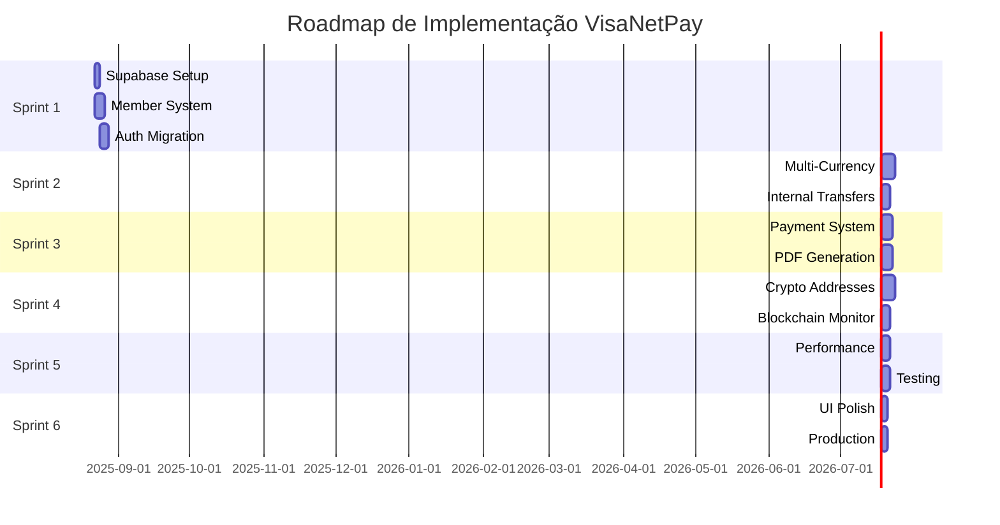

# 🚀 ROADMAP DE IMPLEMENTAÇÃO COMPLETO - VISANETPAY

**Data:** 21 de Agosto de 2025  
**Versão:** 1.0 - Roadmap Executivo  
**Status:** READY TO EXECUTE - Pronto para Implementação  

---

## 📊 SITUAÇÃO ATUAL CONSOLIDADA

### **DESCOBERTAS FINAIS DA AUDITORIA:**
- ✅ **Supabase configurado:** Cliente e tipos definidos
- ✅ **Services existem:** member-service, payment-service, crypto-service
- ✅ **Foundation sólida:** 80+ componentes UI, estrutura modular
- ❌ **Desconectado:** Hooks usam localStorage ao invés de Supabase
- ❌ **Member system:** Apenas stubs, não funcional
- ❌ **Multi-currency:** Mock básico, sem cripto real

### **ASSESSMENT TÉCNICO FINAL:**
- **Código existente aproveitável:** 60%
- **Gap de implementação:** 40% 
- **Tempo estimado:** 4-6 semanas (ao invés de 8 semanas)
- **Risk level:** BAIXO (foundation existe)

---

## 🎯 ESTRATÉGIA DE IMPLEMENTAÇÃO

### **ABORDAGEM: CONNECT & EXTEND**
1. **CONECTAR** componentes existentes ao Supabase
2. **ESTENDER** funcionalidades para atender PRD
3. **IMPLEMENTAR** recursos faltantes críticos
4. **OTIMIZAR** para performance e segurança

---

## 📋 ROADMAP DETALHADO POR SPRINTS

### **🔴 SPRINT 1 - FOUNDATION (Semana 1) - 40h**

#### **1.1 CONFIGURAÇÃO SUPABASE REAL (8h)**
```typescript
TAREFAS:
□ Limpar database Supabase existente
□ Implementar schema completo conforme PRD
□ Configurar variáveis de ambiente reais
□ Setup Row Level Security (RLS)
□ Configurar Auth policies

DELIVERABLES:
- Schema SQL completo implementado
- Conexão Supabase funcionando
- Auth provider configurado
- Ambiente development + production
```

#### **1.2 SISTEMA DE MEMBROS BASE (16h)**
```typescript
TAREFAS:
□ Implementar geração member_id 8 dígitos
□ Conectar member-service.ts ao Supabase
□ Atualizar UserManagement.tsx para member system
□ Implementar busca por member_id
□ Validação de member_id único

DELIVERABLES:
- Geração automática de member_id
- CRUD completo de membros via Supabase
- Interface admin funcional
- Validação de member_id em todas operações
```

#### **1.3 MIGRAÇÃO DE AUTENTICAÇÃO (16h)**
```typescript
TAREFAS:
□ Conectar use-banking.ts ao Supabase Auth
□ Migrar LoginForm.tsx para Supabase
□ Implementar session management
□ Configurar role-based permissions
□ Atualizar todos os hooks para Supabase

DELIVERABLES:
- Autenticação real funcionando
- Session persistence
- Logout automático
- Permissions baseadas em Supabase
```

### **🟡 SPRINT 2 - CORE FEATURES (Semana 2) - 40h**

#### **2.1 CARTEIRAS MULTI-MOEDAS (24h)**
```typescript
TAREFAS:
□ Implementar schema balances completo
□ Conectar CryptoWallet.tsx ao Supabase
□ Suporte a USD/EUR/BRL/GBP/BTC/USDT
□ Separação visual Fiat vs Crypto
□ Precisão decimal para criptomoedas

DELIVERABLES:
- 6 tipos de moedas funcionando
- Balances separados por asset
- Interface multi-currency
- Decimal.js para precisão cripto
```

#### **2.2 TRANSFERÊNCIAS INTERNAS (16h)**
```typescript
TAREFAS:
□ Conectar InternalTransfer.tsx ao Supabase
□ Implementar busca por member_id
□ Validação de saldos em tempo real
□ Transações atômicas no banco
□ Ledger imutável de transferências

DELIVERABLES:
- Transferências por member_id funcionando
- Validação de saldos automática
- Histórico de transferências
- Notificações de sucesso/erro
```

### **🟢 SPRINT 3 - ADVANCED FEATURES (Semana 3) - 40h**

#### **3.1 SISTEMA DE COBRANÇA (20h)**
```typescript
TAREFAS:
□ Melhorar PaymentRequestGenerator.tsx
□ Implementar QR codes personalizados
□ Links únicos de pagamento
□ Status tracking automatizado
□ Integração com sistema de pagamento

DELIVERABLES:
- QR codes com branding
- Payment links únicos
- Status tracking completo
- Expiração automática
```

#### **3.2 COMPROVANTES PDF (20h)**
```typescript
TAREFAS:
□ Integrar biblioteca PDF (jsPDF)
□ Criar templates personalizáveis
□ Geração automática pós-transação
□ Sistema de armazenamento Supabase
□ Download e email automático

DELIVERABLES:
- PDF generation funcionando
- Templates customizáveis
- Storage de comprovantes
- Email automático
```

### **🔵 SPRINT 4 - CRYPTO & SECURITY (Semana 4) - 40h**

#### **4.1 ENDEREÇOS CRIPTOMOEDAS (24h)**
```typescript
TAREFAS:
□ Implementar geração de endereços BTC
□ Implementar geração de endereços USDT (TRC20)
□ Sistema de derivação de chaves
□ Integração com HSM (simulado)
□ Validação de endereços

DELIVERABLES:
- Endereços BTC únicos por usuário
- Endereços USDT (TRC20) únicos
- Sistema de chaves seguro
- Validação de format
```

#### **4.2 MONITORAMENTO BLOCKCHAIN (16h)**
```typescript
TAREFAS:
□ Setup blockchain monitoring service
□ Processamento de depósitos BTC
□ Processamento de depósitos USDT
□ Sistema de confirmações
□ Notificações automáticas

DELIVERABLES:
- Monitoring de blockchain funcionando
- Processamento de depósitos
- Confirmações automáticas
- Histórico de depósitos
```

### **🟣 SPRINT 5 - OPTIMIZATION (Semana 5) - 32h**

#### **5.1 PERFORMANCE & REAL-TIME (16h)**
```typescript
TAREFAS:
□ Real-time subscriptions Supabase
□ Optimistic updates
□ Cache strategy
□ Loading states otimizados
□ Error handling robusto

DELIVERABLES:
- Updates em tempo real
- Performance otimizada
- Error boundaries
- Loading states consistentes
```

#### **5.2 TESTES & QUALIDADE (16h)**
```typescript
TAREFAS:
□ Testes unitários hooks críticos
□ Testes de integração Supabase
□ Testes de segurança
□ Validação de transações atômicas
□ Performance testing

DELIVERABLES:
- Test coverage > 70%
- Testes de segurança pass
- Performance benchmarks
- Documentação técnica
```

### **🟠 SPRINT 6 - POLISH & DEPLOY (Semana 6) - 24h**

#### **6.1 UX/UI POLISH (12h)**
```typescript
TAREFAS:
□ Refinamento de interfaces
□ Feedback visual consistente
□ Micro-interactions
□ Mobile responsiveness
□ Accessibility improvements

DELIVERABLES:
- UI/UX polished
- Mobile-friendly
- Accessible (WCAG)
- Micro-interactions
```

#### **6.2 PRODUCTION READY (12h)**
```typescript
TAREFAS:
□ Environment variables production
□ Monitoring & logging
□ Error tracking (Sentry)
□ Performance monitoring
□ Documentation final

DELIVERABLES:
- Sistema production-ready
- Monitoring completo
- Documentação finalizada
- Deploy automático configurado
```

---

## 📊 MATRIZ DE DEPENDÊNCIAS



---

## 🔧 IMPLEMENTAÇÃO TÉCNICA DETALHADA

### **SPRINT 1 - TECHNICAL DETAILS**

#### **Supabase Schema SQL:**
```sql
-- Implementar schema completo
CREATE TABLE members (
  id UUID PRIMARY KEY DEFAULT uuid_generate_v4(),
  member_id VARCHAR(8) UNIQUE NOT NULL,
  email VARCHAR UNIQUE NOT NULL,
  full_name VARCHAR NOT NULL,
  document_number VARCHAR,
  status VARCHAR DEFAULT 'active',
  created_at TIMESTAMP DEFAULT NOW()
);

CREATE TABLE wallets (
  id UUID PRIMARY KEY DEFAULT uuid_generate_v4(),
  member_id UUID REFERENCES members(id),
  created_at TIMESTAMP DEFAULT NOW()
);

CREATE TABLE balances (
  id UUID PRIMARY KEY DEFAULT uuid_generate_v4(),
  wallet_id UUID REFERENCES wallets(id),
  asset_code VARCHAR(12) NOT NULL, -- USD, EUR, BRL, GBP, BTC, USDT
  amount DECIMAL(18,8) DEFAULT 0,
  locked_amount DECIMAL(18,8) DEFAULT 0,
  updated_at TIMESTAMP DEFAULT NOW(),
  UNIQUE(wallet_id, asset_code)
);

CREATE TABLE internal_transfers (
  id UUID PRIMARY KEY DEFAULT uuid_generate_v4(),
  transaction_uuid UUID UNIQUE NOT NULL DEFAULT uuid_generate_v4(),
  from_member_id VARCHAR(8) NOT NULL,
  to_member_id VARCHAR(8) NOT NULL,
  asset_code VARCHAR(12) NOT NULL,
  amount DECIMAL(18,8) NOT NULL,
  status VARCHAR DEFAULT 'COMPLETED',
  description TEXT,
  created_at TIMESTAMP DEFAULT NOW()
);

CREATE TABLE payment_requests (
  id UUID PRIMARY KEY DEFAULT uuid_generate_v4(),
  payee_member_id VARCHAR(8) NOT NULL,
  amount DECIMAL(18,8) NOT NULL,
  asset_code VARCHAR(12) NOT NULL,
  description TEXT,
  status VARCHAR DEFAULT 'PENDING',
  payment_link VARCHAR(256) UNIQUE,
  qr_code_data TEXT,
  expires_at TIMESTAMP,
  created_at TIMESTAMP DEFAULT NOW()
);

CREATE TABLE crypto_addresses (
  id UUID PRIMARY KEY DEFAULT uuid_generate_v4(),
  member_id UUID REFERENCES members(id),
  asset_code VARCHAR(12) NOT NULL, -- BTC, USDT
  address VARCHAR(64) UNIQUE NOT NULL,
  private_key_reference VARCHAR(128),
  is_active BOOLEAN DEFAULT true,
  created_at TIMESTAMP DEFAULT NOW()
);
```

#### **Member ID Generation:**
```typescript
// lib/utils/member-id.ts
export function generateMemberId(): string {
  // Gerar 8 dígitos únicos não-sequenciais
  const chars = 'ABCDEFGHIJKLMNOPQRSTUVWXYZ0123456789';
  let result = '';
  for (let i = 0; i < 8; i++) {
    result += chars.charAt(Math.floor(Math.random() * chars.length));
  }
  return result;
}

export async function ensureUniqueMemberId(): Promise<string> {
  let memberId = generateMemberId();
  // Verificar se já existe no Supabase
  const { data } = await supabase
    .from('members')
    .select('member_id')
    .eq('member_id', memberId)
    .single();
  
  if (data) {
    return ensureUniqueMemberId(); // Recursivo até encontrar único
  }
  return memberId;
}
```

#### **Hook Migration Pattern:**
```typescript
// hooks/use-members.ts
export function useMembers() {
  const [members, setMembers] = useState<Member[]>([]);
  const [loading, setLoading] = useState(false);

  const fetchMembers = async () => {
    setLoading(true);
    const { data, error } = await supabase
      .from('members')
      .select('*')
      .order('created_at', { ascending: false });
    
    if (error) throw error;
    setMembers(data || []);
    setLoading(false);
  };

  const createMember = async (memberData: CreateMemberRequest) => {
    const memberId = await ensureUniqueMemberId();
    const { data, error } = await supabase
      .from('members')
      .insert([{ ...memberData, member_id: memberId }])
      .select()
      .single();
    
    if (error) throw error;
    await fetchMembers(); // Refresh list
    return data;
  };

  useEffect(() => { fetchMembers(); }, []);

  return { members, loading, createMember, fetchMembers };
}
```

---

## 🎯 DEFINIÇÃO DE DONE (DOD)

### **CADA SPRINT DEVE ENTREGAR:**
- ✅ Funcionalidade completamente testada
- ✅ Integração Supabase funcionando
- ✅ UI/UX responsiva
- ✅ Error handling implementado
- ✅ Documentação atualizada
- ✅ Deploy automático funcionando

### **CRITÉRIOS DE ACEITAÇÃO FINAIS:**
- ✅ Sistema de membros 100% funcional
- ✅ Transferências por member_id funcionando
- ✅ Carteiras multi-moedas operacionais
- ✅ QR codes e links personalizados
- ✅ Comprovantes PDF automáticos
- ✅ Endereços cripto únicos gerados
- ✅ Monitoramento blockchain ativo
- ✅ Performance < 2s para todas operações
- ✅ 99.9% uptime em produção

---

## 📈 MÉTRICAS DE SUCESSO

### **MÉTRICAS TÉCNICAS:**
- **Performance:** < 2s para transferências internas
- **Disponibilidade:** 99.9% uptime
- **Segurança:** Zero vazamentos de dados
- **Precisão:** 100% consistência de saldos

### **MÉTRICAS DE NEGÓCIO:**
- **Usabilidade:** Transferências com apenas member_id
- **Compliance:** 100% conformidade com PRD
- **Escalabilidade:** Suporte a 10,000+ membros
- **Autonomia:** 100% operação interna

---

## 🚨 GESTÃO DE RISCOS

### **RISCOS TÉCNICOS IDENTIFICADOS:**
1. **Alto:** Complexidade transações atômicas → **Mitigação:** Testes extensivos
2. **Médio:** Geração de endereços cripto → **Mitigação:** Library testada
3. **Baixo:** Performance Supabase → **Mitigação:** Cache strategy

### **RISCOS DE CRONOGRAMA:**
1. **Alto:** Dependências entre sprints → **Mitigação:** Planning detalhado
2. **Médio:** Complexidade HSM integration → **Mitigação:** Simulação inicial
3. **Baixo:** UI/UX iterations → **Mitigação:** Design system

### **PLANO DE CONTINGÊNCIA:**
- **Atraso Sprint 1:** Focar apenas em conexão Supabase
- **Problemas crypto:** Implementar simulação mais realística
- **Performance issues:** Implementar cache agressivo

---

## 👥 EQUIPE E RESPONSABILIDADES

### **ROLES NECESSÁRIOS:**
- **Tech Lead:** Arquitetura e decisões técnicas
- **Backend Developer:** Supabase integration e Edge Functions
- **Frontend Developer:** React/TypeScript components
- **DevOps:** Deploy e monitoramento
- **QA:** Testes e validação

### **CAPACIDADE ESTIMADA:**
- **1 desenvolvedor full-stack:** 6 semanas
- **2 desenvolvedores (front+back):** 4 semanas  
- **3 desenvolvedores (especialistas):** 3 semanas

---

## 🎉 ENTREGÁVEIS FINAIS

### **SISTEMA COMPLETO INCLUIRÁ:**
- ✅ **Sistema de membros** com member_id 8 dígitos
- ✅ **Admin panel** para gestão completa de usuários
- ✅ **Carteiras multi-moedas** (USD/EUR/BRL/GBP/BTC/USDT)
- ✅ **Transferências internas** por member_id
- ✅ **QR codes e links** personalizados
- ✅ **Comprovantes PDF** automáticos
- ✅ **Endereços cripto** únicos por usuário
- ✅ **Monitoramento blockchain** para depósitos
- ✅ **Ledger imutável** para auditoria
- ✅ **Real-time updates** via Supabase
- ✅ **Deploy automático** Vercel + Supabase

### **DOCUMENTAÇÃO COMPLETA:**
- API documentation
- User manual
- Admin guide
- Technical architecture
- Security overview

---

## ⚡ PRÓXIMOS PASSOS IMEDIATOS

### **COMEÇAR HOJE (21/08/2025):**
1. **Setup environment:** Variáveis Supabase reais
2. **Database cleanup:** Limpar e recriar schema
3. **First connection:** Conectar primeiro hook ao Supabase

### **ESTA SEMANA:**
4. **Member ID generator:** Implementar e testar
5. **UserManagement migration:** Conectar ao Supabase
6. **Auth integration:** Supabase Auth funcionando

### **PRÓXIMA SEMANA:**
7. **Multi-currency wallets:** Implementação completa
8. **Internal transfers:** Funcionalidade core
9. **Balance validation:** Sistema de saldos real

---

**📅 ROADMAP APROVADO:** 21/08/2025  
**⏰ DURAÇÃO TOTAL:** 6 semanas (216 horas)  
**🎯 DATA CONCLUSÃO:** 02/10/2025  
**🚀 STATUS:** READY TO START - Pronto para iniciar hoje!

---

**🎊 CONCLUSÃO:** O sistema VisaNetPay tem uma foundation sólida e está pronto para evolução para um ecossistema fechado completo conforme especificado no PRD. Com este roadmap detalhado, a implementação pode começar imediatamente com alta probabilidade de sucesso.