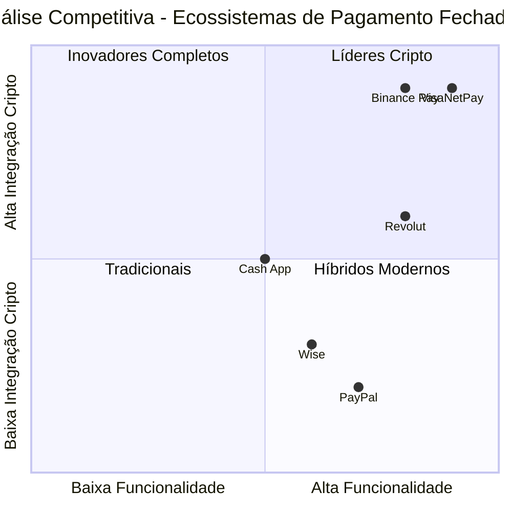

# PRD - VisaNetPay: Sistema Bancário Avançado com Ecossistema Fechado de Pagamentos

## 1. Informações do Projeto

**Linguagem**: Português  
**Linguagem de Programação**: TypeScript, Next.js 14, Shadcn-ui, Tailwind CSS  
**Nome do Projeto**: VisaNetPay  
**Data**: 20 de Agosto de 2025  

### Requisitos Originais
Desenvolver um sistema bancário fechado e simulado integrado com gateway de pagamento para testes internos, incluindo gestão completa de usuários, contas, cartões, pagamentos (PIX, SEPA, SWIFT, ACH), carteira digital com suporte multi-moedas (Fiat e Cripto), sistema de transferências internas, geração de QR Codes e links de pagamento, e monitoramento abrangente.

## 2. Definição do Produto

### 2.1 Objetivos do Produto

1. **Ecossistema Fechado de Pagamentos**: Criar um ambiente completamente autônomo que não depende de fontes externas para transações, operando com ledger interno próprio
2. **Carteiras Multi-Moedas**: Suportar moedas Fiat (USD, EUR, BRL, GBP) e Criptomoedas (BTC, USDT) com balanceamento independente
3. **Transferências Internas**: Implementar sistema de transferências instantâneas entre membros usando ID único de 8 dígitos
4. **Geração de Cobranças**: Criar links de pagamento e QR Codes para facilitar transações
5. **Comprovantes Personalizados**: Gerar recibos em PDF com branding personalizado
6. **Segurança Avançada**: Implementar HSM para gerenciamento de chaves privadas e transações atômicas

### 2.2 Histórias de Usuário Expandidas

**Como administrador do sistema**, quero poder criar usuários com ID de Membro único de 8 dígitos, para que cada usuário tenha uma identificação não-sequencial e segura para transferências internas.

**Como membro da plataforma**, quero poder manter saldos separados em diferentes moedas (USD, EUR, BRL, GBP, BTC, USDT), para que eu possa gerenciar ativos diversificados em uma única conta.

**Como usuário**, quero poder transferir fundos para outros membros usando apenas o ID de 8 dígitos, para que as transações sejam rápidas e simples sem precisar de dados bancários complexos.

**Como comerciante**, quero poder gerar links de pagamento e QR Codes personalizados, para que eu possa receber pagamentos de forma prática e profissional.

**Como usuário da plataforma**, quero receber comprovantes em PDF personalizados após cada transação, para que eu tenha documentação oficial das minhas operações financeiras.

**Como administrador**, quero que todas as chaves privadas de criptomoedas sejam gerenciadas por HSM, para que a segurança dos ativos digitais seja maximizada.

### 2.3 Análise Competitiva Atualizada

#### Concorrentes Principais:

1. **PayPal/Venmo (Ecossistema Fechado)**
   - Prós: Transferências internas rápidas, ampla adoção, interface simples
   - Contras: Limitado a moedas tradicionais, não suporta cripto nativamente

2. **Revolut Business**
   - Prós: Multi-moedas, suporte cripto, cartões virtuais
   - Contras: Dependente de infraestrutura externa, custos elevados

3. **Wise (ex-TransferWise)**
   - Prós: Câmbio competitivo, contas multi-moedas, transparência
   - Contras: Não é ecossistema fechado, limitações em cripto

4. **Binance Pay**
   - Prós: Suporte completo a cripto, transferências instantâneas
   - Contras: Foco apenas em cripto, interface complexa para usuários tradicionais

5. **Square Cash App**
   - Prós: QR Codes, transferências P2P, suporte Bitcoin
   - Contras: Limitado geograficamente, não suporta múltiplas criptos

### 2.4 Quadrante Competitivo Atualizado



## 3. Especificações Técnicas Avançadas

### 3.1 Análise de Requisitos Expandida

O sistema VisaNetPay deve implementar um ecossistema fechado completo com as seguintes capacidades:

- **Ledger Interno Imutável**: Todas as transações são registradas em um ledger append-only
- **Carteiras Multi-Asset**: Suporte nativo para 4 moedas Fiat e 2 Criptomoedas
- **Transferências Atômicas**: Garantia de consistência através de transações de banco de dados
- **Geração de Endereços Cripto**: Criação única de endereços BTC e USDT por usuário
- **Sistema de Cobrança**: Geração de QR Codes e links de pagamento personalizados
- **HSM Integration**: Gerenciamento seguro de chaves privadas

### 3.2 Pool de Requisitos Expandido

#### Prioridade P0 (Essencial)

- **REQ-001**: Sistema DEVE implementar ID de Membro único de 8 dígitos não-sequencial
- **REQ-002**: Sistema DEVE suportar carteiras separadas para USD, EUR, BRL, GBP, BTC, USDT
- **REQ-003**: Sistema DEVE gerar endereços únicos de BTC e USDT para cada usuário
- **REQ-004**: Sistema DEVE implementar transferências internas atômicas via ID de Membro
- **REQ-005**: Sistema DEVE gerar QR Codes e links de pagamento personalizados
- **REQ-006**: Sistema DEVE produzir comprovantes em PDF após cada transação
- **REQ-007**: Sistema DEVE integrar com HSM para gerenciamento de chaves privadas cripto
- **REQ-008**: Sistema DEVE manter ledger imutável para todas as operações internas
- **REQ-009**: Sistema DEVE validar saldos antes de processar qualquer transferência
- **REQ-010**: Sistema DEVE suportar monitoramento de blockchain para depósitos cripto

#### Prioridade P1 (Importante)

- **REQ-011**: Sistema DEVE implementar sistema de cobrança com status tracking
- **REQ-012**: Sistema DEVE permitir conversão entre moedas dentro da plataforma
- **REQ-013**: Sistema DEVE implementar limites de transação por moeda e usuário
- **REQ-014**: Sistema DEVE gerar relatórios de auditoria para transações cripto
- **REQ-015**: Sistema DEVE implementar alertas para transações de alto valor
- **REQ-016**: Sistema DEVE suportar transações em lote para administradores
- **REQ-017**: Sistema DEVE implementar backup automático do ledger interno

#### Prioridade P2 (Desejável)

- **REQ-018**: Sistema PODE implementar staking simulado para criptomoedas
- **REQ-019**: Sistema PODE incluir análise de risco para transações cripto
- **REQ-020**: Sistema PODE implementar notificações push para movimentações
- **REQ-021**: Sistema PODE incluir histórico de preços para conversões

### 3.3 Design de Interface Expandido

#### Dashboard Principal Avançado
- **Visão Multi-Moedas**: Cards separados para cada tipo de ativo (Fiat/Cripto)
- **Cotações em Tempo Real**: Display das taxas de câmbio e preços cripto
- **Gráfico de Portfolio**: Distribuição de ativos por moeda
- **Transações Recentes**: Feed em tempo real de todas as movimentações

#### Carteira Multi-Asset
- **Saldos por Moeda**: Visualização clara de cada ativo disponível
- **Endereços de Depósito**: Geração e exibição de endereços cripto únicos
- **Histórico por Asset**: Transações filtradas por tipo de moeda
- **Conversão Interna**: Interface para troca entre moedas da plataforma

#### Sistema de Transferências
- **Busca por ID de Membro**: Campo de busca com validação de 8 dígitos
- **Seleção de Moeda**: Dropdown com saldos disponíveis
- **Confirmação Detalhada**: Modal com todos os detalhes antes da confirmação
- **Status em Tempo Real**: Feedback imediato do processamento

#### Gerador de Cobranças
- **Wizard de Criação**: Passo-a-passo para criar links e QR Codes
- **Personalização**: Opções de branding e descrição personalizada
- **Compartilhamento**: Múltiplas opções de distribuição (email, WhatsApp, etc)
- **Tracking**: Acompanhamento de status das cobranças enviadas

### 3.4 Questões em Aberto Expandidas

1. **Conformidade Cripto**: Quais regulamentações de criptomoedas devemos seguir para diferentes jurisdições?

2. **Taxas de Rede**: Como simular taxas de rede Bitcoin e Ethereum de forma realística?

3. **Custódia vs Non-Custodial**: Devemos implementar opções para que usuários controlem suas próprias chaves?

4. **Integração com Exchanges**: Futuramente, integrar com exchanges para cotações e liquidez real?

5. **Compliance AML/KYC**: Que nível de verificação de identidade implementar no ambiente de teste?

## 4. Arquitetura do Sistema Avançada

### 4.1 Componentes Principais Expandidos

#### Frontend (Next.js 14 + TypeScript)
```
/src
  /components
    /dashboard         # Dashboard multi-moedas
    /wallets          # Carteiras por tipo de ativo
    /transfers        # Sistema de transferências internas
    /payments         # Geração de QR e links
    /crypto           # Interfaces específicas para cripto
    /receipts         # Visualização de comprovantes PDF
    /admin           # Painéis administrativos HSM
  /hooks
    /use-multi-wallet # Gestão de carteiras multi-asset
    /use-crypto      # Operações de criptomoedas
    /use-transfers   # Transferências internas
    /use-payments    # Sistema de cobrança
  /lib
    /crypto-utils    # Utilitários para blockchain
    /pdf-generator   # Geração de comprovantes
    /qr-generator    # Criação de QR Codes
    /hsm-integration # Interface com HSM
```

#### Backend Expandido (Supabase + Edge Functions)
```sql
-- Schema expandido para ecossistema fechado

-- Tabela de usuários com ID de Membro
CREATE TABLE users (
  id UUID PRIMARY KEY DEFAULT uuid_generate_v4(),
  member_id VARCHAR(8) UNIQUE NOT NULL, -- ID único de 8 dígitos
  email VARCHAR UNIQUE NOT NULL,
  name VARCHAR NOT NULL,
  role VARCHAR NOT NULL CHECK (role IN ('admin', 'manager', 'operator', 'user')),
  permissions JSONB DEFAULT '{}',
  status VARCHAR DEFAULT 'active',
  created_at TIMESTAMP DEFAULT NOW(),
  updated_at TIMESTAMP DEFAULT NOW()
);

-- Tabela de carteiras por usuário
CREATE TABLE wallets (
  id UUID PRIMARY KEY DEFAULT uuid_generate_v4(),
  user_id UUID REFERENCES users(id) ON DELETE CASCADE,
  created_at TIMESTAMP DEFAULT NOW()
);

-- Tabela de saldos por ativo
CREATE TABLE balances (
  id UUID PRIMARY KEY DEFAULT uuid_generate_v4(),
  wallet_id UUID REFERENCES wallets(id) ON DELETE CASCADE,
  asset_code VARCHAR(12) NOT NULL, -- 'USD', 'EUR', 'BRL', 'GBP', 'BTC', 'USDT_TRC20'
  amount DECIMAL(18,8) DEFAULT 0, -- Alta precisão para cripto
  locked_amount DECIMAL(18,8) DEFAULT 0, -- Para transações pendentes
  updated_at TIMESTAMP DEFAULT NOW(),
  UNIQUE(wallet_id, asset_code)
);

-- Endereços de criptomoedas
CREATE TABLE crypto_addresses (
  id UUID PRIMARY KEY DEFAULT uuid_generate_v4(),
  user_id UUID REFERENCES users(id) ON DELETE CASCADE,
  asset_code VARCHAR(12) NOT NULL, -- 'BTC', 'USDT_TRC20'
  address VARCHAR(64) UNIQUE NOT NULL, -- Endereço público
  private_key_reference VARCHAR(128) NOT NULL, -- Referência HSM
  is_active BOOLEAN DEFAULT true,
  created_at TIMESTAMP DEFAULT NOW()
);

-- Ledger imutável de transferências internas
CREATE TABLE internal_transfers (
  id UUID PRIMARY KEY DEFAULT uuid_generate_v4(),
  transaction_uuid UUID UNIQUE NOT NULL DEFAULT uuid_generate_v4(),
  payer_wallet_id UUID REFERENCES wallets(id),
  payee_wallet_id UUID REFERENCES wallets(id),
  asset_code VARCHAR(12) NOT NULL,
  amount DECIMAL(18,8) NOT NULL,
  status VARCHAR NOT NULL DEFAULT 'COMPLETED' CHECK (status IN ('COMPLETED', 'FAILED')),
  related_payment_request_id UUID REFERENCES payment_requests(id) NULL,
  description TEXT,
  metadata JSONB DEFAULT '{}',
  created_at TIMESTAMP DEFAULT NOW()
);

-- Sistema de cobrança (QR Codes e Links)
CREATE TABLE payment_requests (
  id UUID PRIMARY KEY DEFAULT uuid_generate_v4(),
  payee_user_id UUID REFERENCES users(id) ON DELETE CASCADE,
  amount DECIMAL(18,8) NOT NULL,
  asset_code VARCHAR(12) NOT NULL,
  description TEXT,
  status VARCHAR DEFAULT 'PENDING' CHECK (status IN ('PENDING', 'PAID', 'EXPIRED', 'CANCELLED')),
  payment_link VARCHAR(256) UNIQUE,
  qr_code_data TEXT, -- Base64 do QR Code
  expires_at TIMESTAMP,
  paid_at TIMESTAMP NULL,
  paid_by_user_id UUID REFERENCES users(id) NULL,
  created_at TIMESTAMP DEFAULT NOW()
);

-- Histórico de depósitos cripto (monitoramento blockchain)
CREATE TABLE crypto_deposits (
  id UUID PRIMARY KEY DEFAULT uuid_generate_v4(),
  user_id UUID REFERENCES users(id) ON DELETE CASCADE,
  crypto_address_id UUID REFERENCES crypto_addresses(id),
  asset_code VARCHAR(12) NOT NULL,
  amount DECIMAL(18,8) NOT NULL,
  transaction_hash VARCHAR(128) UNIQUE NOT NULL,
  block_height BIGINT,
  confirmations INTEGER DEFAULT 0,
  status VARCHAR DEFAULT 'PENDING' CHECK (status IN ('PENDING', 'CONFIRMED', 'FAILED')),
  processed_at TIMESTAMP NULL,
  created_at TIMESTAMP DEFAULT NOW()
);

-- Comprovantes gerados
CREATE TABLE receipts (
  id UUID PRIMARY KEY DEFAULT uuid_generate_v4(),
  transfer_id UUID REFERENCES internal_transfers(id),
  pdf_path VARCHAR(512),
  pdf_data BYTEA, -- Dados do PDF
  generated_at TIMESTAMP DEFAULT NOW()
);

-- Índices para performance
CREATE INDEX idx_users_member_id ON users(member_id);
CREATE INDEX idx_balances_wallet_asset ON balances(wallet_id, asset_code);
CREATE INDEX idx_transfers_payer ON internal_transfers(payer_wallet_id);
CREATE INDEX idx_transfers_payee ON internal_transfers(payee_wallet_id);
CREATE INDEX idx_payment_requests_payee ON payment_requests(payee_user_id);
CREATE INDEX idx_crypto_deposits_user ON crypto_deposits(user_id);
```

### 4.2 Fluxos de Processo Expandidos

#### Fluxo de Registro e Criação de Carteira
1. Cadastro do usuário com validação de email
2. Geração de member_id único de 8 dígitos não-sequencial
3. Criação de registro de carteira (wallets)
4. Inicialização de saldos zero para todas as moedas suportadas
5. Geração de endereços únicos BTC e USDT via HSM
6. Notificação de conclusão com dados da carteira

#### Fluxo de Transferência Interna
1. Usuário insere member_id do destinatário (8 dígitos)
2. Sistema valida existência do member_id
3. Usuário seleciona asset_code e amount
4. Validação de saldo suficiente na balance
5. Início de transação atômica no banco:
   - Lock do saldo do pagador
   - Débito na balance do pagador
   - Crédito na balance do recebedor
   - Criação de registro em internal_transfers
6. Commit da transação
7. Geração automática de comprovante PDF
8. Notificação para ambas as partes

#### Fluxo de Geração de QR Code/Link
1. Usuário especifica amount, asset_code e description
2. Sistema cria registro em payment_requests
3. Geração de URL única: https://platform.com/pay/{request_id}
4. Criação de QR Code com dados da cobrança
5. Retorno de link e QR Code em base64
6. Opções de compartilhamento (email, WhatsApp, copy link)

#### Fluxo de Pagamento via QR/Link
1. Usuário acessa link ou escaneia QR Code
2. Redirecionamento para plataforma com request_id
3. Exibição de detalhes da cobrança
4. Confirmação do pagamento (se logado)
5. Execução do fluxo de transferência interna
6. Atualização do status da payment_request para 'PAID'
7. Notificação para o criador da cobrança

#### Fluxo de Depósito Cripto
1. Sistema monitora blockchain para transações nos endereços
2. Detecção de transação para endereço de usuário
3. Criação de registro em crypto_deposits
4. Aguarda confirmações necessárias (6 para BTC, 12 para USDT)
5. Após confirmações, credita amount na balance do usuário
6. Atualização de status para 'CONFIRMED'
7. Notificação de depósito processado

## 5. Considerações de Segurança Expandidas

### 5.1 Gerenciamento de Chaves Privadas (HSM)
- **Hardware Security Module**: Integração obrigatória com HSM para custódia de chaves
- **Referências Seguras**: Armazenamento apenas de referências, nunca chaves completas
- **Assinatura Distribuída**: Múltiplas assinaturas para transações de alto valor
- **Backup Criptografado**: Backup das referências com criptografia AES-256

### 5.2 Transações Atômicas
- **Database Transactions**: Todas as operações de saldo em transações ACID
- **Rollback Automático**: Reversão imediata em caso de falha
- **Locks Otimistas**: Prevenção de condições de corrida em saldos
- **Idempotência**: Prevenção de transações duplicadas

### 5.3 Auditoria Avançada
- **Ledger Imutável**: Tabela append-only para todas as transferências
- **Hash Chain**: Encadeamento criptográfico dos registros
- **Timestamps Precisos**: Registro com precisão de microssegundos
- **Assinaturas Digitais**: Validação criptográfica de cada operação

### 5.4 Validação de Entrada
- **Member ID**: Validação de formato exato (8 dígitos)
- **Amounts**: Validação de precisão por tipo de ativo
- **Addresses**: Validação de formato para endereços cripto
- **Rate Limiting**: Limitação de tentativas por usuário/IP

## 6. Cronograma de Implementação Expandido

### Fase 1 - Infraestrutura Base (Semana 1-2)
- Configuração do ambiente expandido
- Schema de banco de dados completo
- Sistema de autenticação com member_id
- Integração inicial com HSM

### Fase 2 - Carteiras Multi-Asset (Semana 3-4)
- Sistema de carteiras e saldos
- Geração de endereços cripto
- Interface de visualização multi-moedas
- Funcionalidades básicas de saldo

### Fase 3 - Transferências Internas (Semana 5-6)
- Sistema de transferências por member_id
- Transações atômicas
- Validação de saldos
- Ledger imutável

### Fase 4 - Sistema de Cobrança (Semana 7-8)
- Geração de QR Codes e links
- Interface de pagamento
- Tracking de status
- Expiração automática

### Fase 5 - Comprovantes e PDF (Semana 9)
- Geração automática de comprovantes
- Templates personalizáveis
- Sistema de armazenamento
- Download e email

### Fase 6 - Monitoramento Blockchain (Semana 10-11)
- Serviço de monitoramento BTC/USDT
- Processamento de depósitos
- Sistema de confirmações
- Notificações automáticas

### Fase 7 - Testes e Segurança (Semana 12)
- Testes de segurança HSM
- Auditoria de transações atômicas
- Testes de carga
- Penetration testing

## 7. Critérios de Sucesso Expandidos

### Métricas Técnicas
- **Disponibilidade**: 99.95% de uptime
- **Performance**: Transferências internas em <1 segundo
- **Segurança**: Zero comprometimento de chaves privadas
- **Consistência**: 100% das transações atômicas bem-sucedidas
- **Precisão**: Zero erros de cálculo em operações multi-moeda

### Métricas de Usabilidade
- **Simplicidade**: Transferências com apenas member_id + amount
- **Clareza**: Saldos separados claramente visíveis por moeda
- **Rapidez**: QR Codes gerados em <2 segundos
- **Confiabilidade**: Comprovantes PDF gerados em 100% das transações

### Métricas de Negócio
- **Autonomia**: 100% das transações processadas internamente
- **Escalabilidade**: Suporte a 10.000+ usuários simultâneos
- **Compliance**: Conformidade total com padrões de segurança financeira
- **Flexibilidade**: Suporte completo a 6 tipos de ativos diferentes

## 8. Conclusão

O VisaNetPay evoluiu para um ecossistema fechado de pagamentos de próxima geração, combinando a simplicidade das transferências tradicionais com a inovação das criptomoedas. O sistema oferece:

- **Ecossistema Verdadeiramente Fechado**: Operação 100% independente com ledger interno
- **Multi-Asset Nativo**: Suporte simultâneo para 4 moedas Fiat e 2 Criptomoedas
- **Segurança Enterprise**: Integração HSM e transações atômicas
- **Experiência de Usuário Superior**: Transferências por ID simples e QR Codes instantâneos
- **Auditoria Completa**: Rastreabilidade total com comprovantes automáticos em PDF

A arquitetura modular e as tecnologias escolhidas garantem que o sistema seja não apenas funcional para testes, mas também uma base sólida para evolução para um produto comercial real.