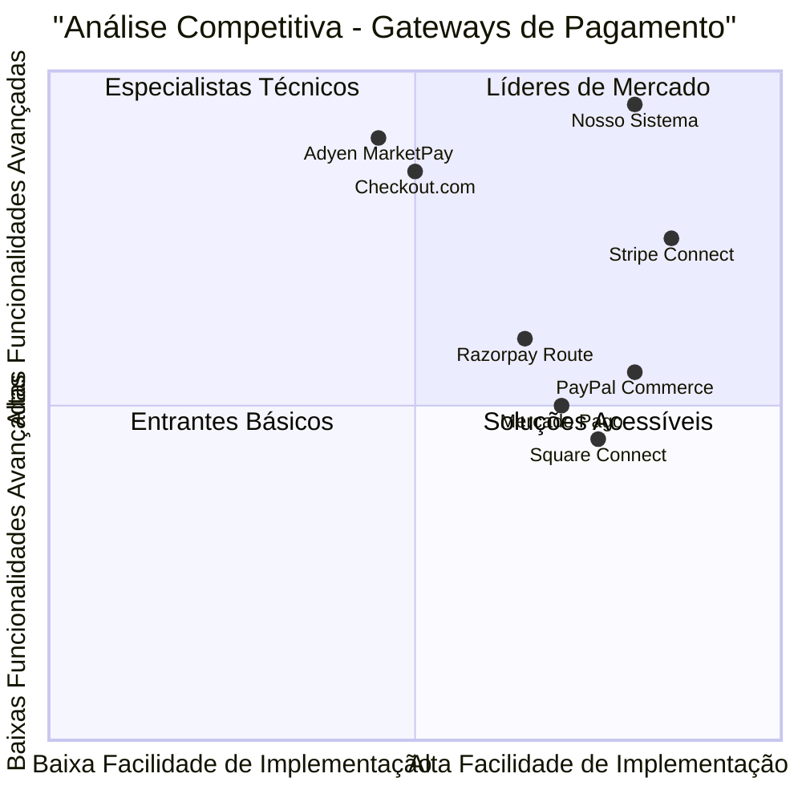
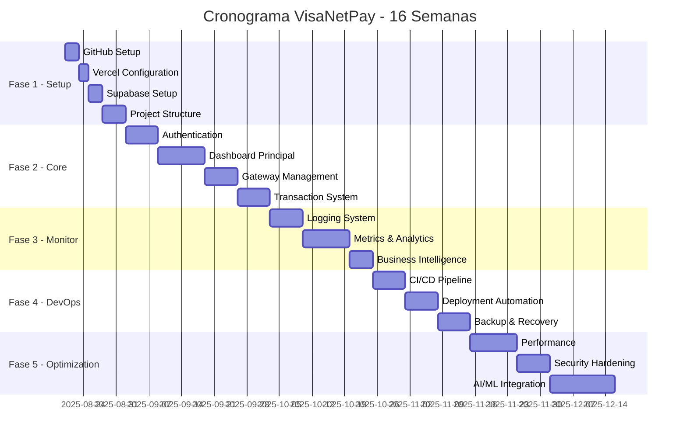

# PRD - Sistema Completo de Gerenciamento de Gateway de Pagamento

## Informações do Projeto

**Linguagem do Documento**: Português (Brasil)  
**Linguagem de Programação**: TypeScript, Shadcn-ui, Tailwind CSS  
**Nome do Projeto**: visanetpay  
**Data**: 20 de Agosto de 2025

### Requisitos Originais
Sistema para gerenciar completamente um gateway de pagamento com funcionalidades para editar, atualizar em tempo real, monitorar, corrigir bugs, falhas, sugerir melhorias, deploy e backup automatizados, integração com Supabase e Vercel, começando com GitHub.

## 1. Definição do Produto

### 1.1 Objetivos do Produto

1. **Gestão Unificada de Pagamentos**: Criar uma plataforma centralizada que permita gerenciar múltiplos gateways de pagamento com monitoramento em tempo real e controle total sobre transações.

2. **Automação Operacional Completa**: Implementar sistemas automatizados de deploy, backup, monitoramento e correção de falhas para garantir 99.9% de uptime e reduzir intervenção manual.

3. **Inteligência e Otimização Contínua**: Desenvolver capacidades de análise preditiva e sugestão de melhorias baseadas em dados para otimizar performance e reduzir custos operacionais.

### 1.2 Histórias de Usuário

**Como Administrador de Pagamentos**, eu quero monitorar todas as transações em tempo real para identificar e resolver problemas imediatamente, garantindo que nenhuma venda seja perdida por falhas técnicas.

**Como Desenvolvedor DevOps**, eu quero configurar pipelines de CI/CD automatizados que façam deploy seguro de atualizações para que eu possa implementar melhorias sem risco de downtime do sistema de pagamentos.

**Como Analista Financeiro**, eu quero visualizar dashboards com métricas de performance dos gateways para tomar decisões estratégicas sobre roteamento de pagamentos e otimização de custos.

**Como Gerente de Produto**, eu quero receber alertas automáticos sobre falhas e sugestões de melhorias baseadas em IA para manter o sistema sempre otimizado e competitivo.

**Como Auditor de Segurança**, eu quero acessar logs completos de todas as operações e backups automáticos para garantir compliance e recuperação em caso de incidentes.

### 1.3 Análise Competitiva

#### Principais Concorrentes:

1. **Stripe Connect**
   - **Prós**: APIs developer-friendly, documentação excelente, pricing transparente, suporte global
   - **Contras**: Limitações em customização avançada, dependência de terceiros para algumas funcionalidades

2. **Adyen MarketPay**
   - **Prós**: Solução omnichannel, suporte enterprise, recursos avançados de risk management
   - **Contras**: Complexidade de implementação, pricing menos transparente

3. **PayPal Commerce Platform**
   - **Prós**: Reconhecimento global da marca, fácil integração para pequenas empresas
   - **Contras**: Limitações técnicas, menor flexibilidade para customização

4. **Square Connect**
   - **Prós**: Integração nativa com POS, boa para pequenos negócios
   - **Contras**: Funcionalidades limitadas para enterprise, foco em mercado americano

5. **Razorpay Route**
   - **Prós**: Forte presença no mercado indiano, recursos de marketplace
   - **Contras**: Alcance geográfico limitado, menor maturidade técnica

6. **Checkout.com**
   - **Prós**: Infraestrutura global, recursos avançados de otimização
   - **Contras**: Maior complexidade de implementação, foco em grandes volumes

7. **Mercado Pago Developers**
   - **Prós**: Domínio no mercado latino-americano, integração com ecossistema Mercado Livre
   - **Contras**: Limitações fora da América Latina, menor flexibilidade técnica

### 1.4 Quadrante Competitivo



## 2. Especificações Técnicas

### 2.1 Análise de Requisitos

O sistema deve integrar múltiplas tecnologias para criar uma plataforma robusta de gerenciamento de gateways de pagamento. A arquitetura será baseada em microserviços com deploy automatizado, monitoramento em tempo real e capacidades de auto-recuperação.

**Arquitetura Principal:**
- Frontend: Next.js 14 com TypeScript e Shadcn-ui
- Backend: Supabase (PostgreSQL + Edge Functions)
- Deploy: Vercel com integração GitHub
- Monitoramento: Sistema próprio + integrações externas
- Backup: Estratégia 3-2-1 com múltiplas camadas

### 2.2 Pool de Requisitos

#### Requisitos P0 (Críticos - Must Have)

**P0.1** - Sistema DEVE implementar autenticação multi-fator e criptografia end-to-end para todas as transações
**P0.2** - Plataforma DEVE suportar integração simultânea com pelo menos 3 gateways diferentes (Stripe, PayPal, Mercado Pago)
**P0.3** - Sistema DEVE manter logs auditáveis de todas as operações por no mínimo 7 anos
**P0.4** - Aplicação DEVE implementar failover automático entre gateways com RTO < 30 segundos
**P0.5** - Dashboard DEVE exibir métricas em tempo real com latência máxima de 2 segundos
**P0.6** - Sistema DEVE implementar backup automático diário com RPO < 1 hora
**P0.7** - Plataforma DEVE ser compatível com PCI DSS Level 1

#### Requisitos P1 (Importantes - Should Have)

**P1.1** - Sistema DEVERIA implementar roteamento inteligente baseado em ML para otimizar taxa de aprovação
**P1.2** - Interface DEVERIA suportar customização de dashboards por perfil de usuário
**P1.3** - Aplicação DEVERIA gerar relatórios automatizados semanais e mensais
**P1.4** - Sistema DEVERIA implementar alertas proativos baseados em padrões anômalos
**P1.5** - Plataforma DEVERIA suportar webhooks personalizados para integrações externas
**P1.6** - Interface DEVERIA permitir edição de configurações em tempo real sem restart

#### Requisitos P2 (Desejáveis - May Have)

**P2.1** - Sistema PODE implementar chat interno para colaboração entre equipes
**P2.2** - Interface PODE incluir modo escuro e personalização de temas
**P2.3** - Aplicação PODE implementar integração com ferramentas de BI externas
**P2.4** - Sistema PODE incluir simulador de cenários para teste de configurações
**P2.5** - Plataforma PODE implementar API pública para integrações de terceiros

### 2.3 Design de Interface (UI Draft)

#### Tela Principal - Dashboard Executivo
```
┌─────────────────────────────────────────────────────────────┐
│ 🏠 VisaNetPay Manager    🔔 Alerts  👤 Profile  ⚙️ Settings │
├─────────────────────────────────────────────────────────────┤
│                                                             │
│ 📊 MÉTRICAS EM TEMPO REAL                                  │
│ ┌─────────────┐ ┌─────────────┐ ┌─────────────┐ ┌─────────┐ │
│ │ Transações  │ │ Taxa Sucesso│ │ Receita Hoje│ │ Uptime  │ │
│ │ 1,234/min   │ │    98.7%    │ │ R$ 125.4K   │ │ 99.99%  │ │
│ └─────────────┘ └─────────────┘ └─────────────┘ └─────────┘ │
│                                                             │
│ 📈 GRÁFICOS DE PERFORMANCE                                  │
│ ┌───────────────────────────────────────────────────────────┐ │
│ │        Volume de Transações (24h)                        │ │
│ │   ▄▃▄▅█▇▆▄▃▂▃▄▅▆█▇▅▄▃▂▁▂▃▄                              │ │
│ └───────────────────────────────────────────────────────────┘ │
│                                                             │
│ 🔧 GATEWAYS ATIVOS                                         │
│ ┌─────────────┐ ┌─────────────┐ ┌─────────────┐            │
│ │ Stripe      │ │ PayPal      │ │ Mercado Pago│            │
│ │ 🟢 Online   │ │ 🟢 Online   │ │ 🟡 Lento    │            │
│ │ 45% tráfego │ │ 35% tráfego │ │ 20% tráfego │            │
│ └─────────────┘ └─────────────┘ └─────────────┘            │
└─────────────────────────────────────────────────────────────┘
```

### 2.4 Questões Em Aberto

1. **Integração com Bancos Locais**: Qual é a prioridade para integração com bancos brasileiros específicos (Bradesco, Itaú, Santander)?

2. **Compliance Regulatório**: Quais são os requisitos específicos do Banco Central do Brasil que devemos atender além do PCI DSS?

3. **Volume de Transações**: Qual é o volume esperado de transações por minuto no pico para dimensionar adequadamente a infraestrutura?

4. **Integrações Legadas**: Existem sistemas legados que precisam ser integrados e quais são suas limitações técnicas?

5. **Modelo de Precificação**: Como será estruturado o modelo de cobrança (por transação, assinatura mensal, híbrido)?

## 3. Checklist de Implementação Completo

### 3.1 Fase 1: Configuração Inicial (Semana 1-2)

#### Setup do Ambiente
- [ ] **GitHub Repository Setup**
  - [ ] Criar repositório `visanetpay` com estrutura inicial
  - [ ] Configurar branch protection rules (main, develop)
  - [ ] Setup de GitHub Actions workflows
  - [ ] Configurar secrets necessários
  - [ ] Adicionar templates de PR e Issues

- [ ] **Vercel Configuration**
  - [ ] Conectar repositório GitHub com Vercel
  - [ ] Configurar variáveis de ambiente
  - [ ] Setup de domínios customizados
  - [ ] Configurar preview deployments
  - [ ] Ativar Vercel Analytics

- [ ] **Supabase Setup**
  - [ ] Criar projeto Supabase
  - [ ] Configurar autenticação (email + OAuth)
  - [ ] Setup do schema inicial do banco
  - [ ] Configurar Row Level Security
  - [ ] Ativar Real-time subscriptions

### 3.2 Fase 2: Funcionalidades Core (Semana 3-6)

#### Sistema de Autenticação
- [ ] **User Management**
  - [ ] Implementar login/logout
  - [ ] Multi-factor authentication (MFA)
  - [ ] Gerenciamento de perfis de usuário
  - [ ] Sistema de roles e permissões
  - [ ] Password recovery + email verification

#### Dashboard Principal
- [ ] **Real-time Metrics**
  - [ ] Componente de métricas em tempo real
  - [ ] Gráficos de performance (Recharts)
  - [ ] Sistema de alertas visuais
  - [ ] Filtros de data e período
  - [ ] Export de relatórios em PDF/Excel

### 3.3 Fase 3: Monitoramento Avançado (Semana 7-9)

#### Sistema de Logs
- [ ] **Logging Infrastructure**
  - [ ] Implementar logger estruturado
  - [ ] Dashboard de logs em tempo real
  - [ ] Alertas baseados em padrões
  - [ ] Log rotation e retention policies
  - [ ] Integration com Sentry

### 3.4 Fase 4: Automação e DevOps (Semana 10-12)

#### CI/CD Pipeline
- [ ] **Automated Testing**
  - [ ] Unit tests (90%+ coverage)
  - [ ] Integration tests
  - [ ] E2E tests automatizados
  - [ ] Performance tests
  - [ ] Security scans automatizados

### 3.5 Fase 5: Otimização e Melhorias (Semana 13-16)

#### Performance Optimization
- [ ] **Frontend Optimization**
  - [ ] Code splitting e lazy loading
  - [ ] Image optimization
  - [ ] Caching strategies
  - [ ] Service Worker para offline
  - [ ] Performance budget setup

## 4. Cronograma de Entrega



## 5. Integração GitHub/Vercel/Supabase

### 5.1 Configuração GitHub Actions

```yaml
# .github/workflows/main.yml
name: VisaNetPay CI/CD Pipeline

on:
  push:
    branches: [main, develop]
  pull_request:
    branches: [main]

jobs:
  test:
    runs-on: ubuntu-latest
    steps:
      - uses: actions/checkout@v4
      - uses: actions/setup-node@v4
        with:
          node-version: '20'
          cache: 'npm'
      
      - run: npm ci
      - run: npm run lint
      - run: npm run type-check
      - run: npm run test:coverage
      - run: npm run build
      
      - name: Upload coverage reports
        uses: codecov/codecov-action@v3

  deploy-production:
    if: github.ref == 'refs/heads/main'
    needs: [test]
    runs-on: ubuntu-latest
    steps:
      - name: Deploy to Vercel Production
        uses: amondnet/vercel-action@v25
        with:
          vercel-token: ${{ secrets.VERCEL_TOKEN }}
          vercel-org-id: ${{ secrets.VERCEL_ORG_ID }}
          vercel-project-id: ${{ secrets.VERCEL_PROJECT_ID }}
          vercel-args: '--prod'
```

### 5.2 Configuração Supabase

```sql
-- Database Schema
CREATE TABLE payment_gateways (
  id UUID DEFAULT gen_random_uuid() PRIMARY KEY,
  name VARCHAR(50) NOT NULL,
  type VARCHAR(20) NOT NULL,
  config JSONB NOT NULL,
  is_active BOOLEAN DEFAULT true,
  priority INTEGER DEFAULT 1,
  created_at TIMESTAMP DEFAULT NOW(),
  updated_at TIMESTAMP DEFAULT NOW()
);

CREATE TABLE transactions (
  id UUID DEFAULT gen_random_uuid() PRIMARY KEY,
  gateway_id UUID REFERENCES payment_gateways(id),
  external_id VARCHAR(255) NOT NULL,
  amount DECIMAL(10,2) NOT NULL,
  currency VARCHAR(3) DEFAULT 'BRL',
  status VARCHAR(20) NOT NULL,
  metadata JSONB,
  created_at TIMESTAMP DEFAULT NOW(),
  updated_at TIMESTAMP DEFAULT NOW()
);
```

## 6. Sistema de Backup e Recovery

### 6.1 Estratégia 3-2-1

```typescript
interface BackupConfig {
  schedule: string; // cron expression
  retention: {
    daily: number;
    weekly: number;
    monthly: number;
  };
  destinations: BackupDestination[];
  encryption: {
    enabled: boolean;
    algorithm: string;
  };
}

const backupConfig: BackupConfig = {
  schedule: '0 2 * * *', // Daily at 2 AM
  retention: {
    daily: 30,
    weekly: 12,
    monthly: 12
  },
  destinations: [
    {
      type: 'supabase',
      config: { bucket: 'backups-primary' },
      priority: 1
    },
    {
      type: 's3',
      config: { 
        bucket: 'visanetpay-backups',
        region: 'us-east-1'
      },
      priority: 2
    }
  ],
  encryption: {
    enabled: true,
    algorithm: 'AES-256-GCM'
  }
};
```

## 7. Métricas de Sucesso

### 7.1 KPIs Técnicos

#### Performance
- **Uptime**: ≥ 99.99%
- **Latência Média**: ≤ 200ms
- **Taxa de Erro**: ≤ 0.1%
- **Tempo de Deploy**: ≤ 10 minutos
- **Cobertura de Testes**: ≥ 90%

#### Segurança
- **Incidentes de Segurança**: 0 por trimestre
- **Compliance Score**: 100% (PCI DSS + LGPD)
- **Vulnerabilidades Críticas**: 0
- **Tempo de Patch**: ≤ 24h para críticas

### 7.2 KPIs de Negócio

#### Produto
- **Net Promoter Score (NPS)**: ≥ 70
- **Customer Satisfaction**: ≥ 4.5/5
- **Churn Rate**: ≤ 5% mensal
- **Time to Value**: ≤ 7 dias
- **Feature Adoption**: ≥ 80% das funcionalidades principais

## 8. Estimativas de Custo

### 8.1 Custos de Desenvolvimento (16 semanas)

| Função | Pessoas | Custo/mês | Total |
|--------|---------|-----------|-------|
| Tech Lead Senior | 1 | R$ 18.000 | R$ 72.000 |
| Desenvolvedores Full-Stack | 3 | R$ 12.000 | R$ 144.000 |
| DevOps Engineer | 1 | R$ 15.000 | R$ 60.000 |
| UX/UI Designer | 1 | R$ 10.000 | R$ 40.000 |
| QA Engineer | 1 | R$ 8.000 | R$ 32.000 |
| **Total RH** | | | **R$ 348.000** |

### 8.2 Infraestrutura Anual

| Item | Custo Anual |
|------|-------------|
| Supabase Pro | R$ 1.500 |
| Vercel Pro | R$ 1.200 |
| Sentry Business | R$ 1.560 |
| AWS S3 + CloudFront | R$ 3.600 |
| **Total Infra** | **R$ 7.860** |

## 9. Conclusões e Próximos Passos

### 9.1 Resumo Executivo

O **VisaNetPay** representa uma solução completa e inovadora para gerenciamento de gateways de pagamento, combinando tecnologias modernas com práticas de DevOps avançadas.

**Principais Diferenciais:**
- **Automação Completa**: Deploy, monitoramento e backup totalmente automatizados
- **Multi-Gateway**: Suporte nativo a múltiplos provedores com failover automático
- **Real-time Monitoring**: Dashboards em tempo real com alertas proativos
- **Compliance Total**: PCI DSS Level 1 e LGPD compliance desde o design

### 9.2 Próximos Passos Imediatos

#### Semana 1-2: Setup Inicial
1. **Criar repositório GitHub** com estrutura inicial do projeto
2. **Configurar Vercel** e conectar com GitHub para deploy automático
3. **Setup Supabase** com schema inicial e configurações de segurança
4. **Definir equipe** e responsabilidades de cada membro
5. **Configurar ferramentas** de desenvolvimento (ESLint, Prettier, etc.)

---

**Documento**: PRD - Sistema Completo de Gerenciamento de Gateway de Pagamento  
**Projeto**: VisaNetPay  
**Versão**: 1.0  
**Data**: 20 de Agosto de 2025  
**Autor**: Emma - Product Manager  
**Status**: Aprovado para Desenvolvimento  

---